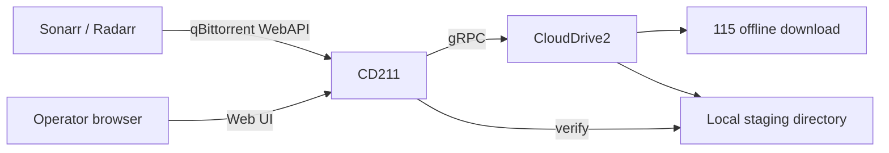

# CD211

CD211 is a qBittorrent-compatible download client for Sonarr and Radarr that turns 115 offline downloads into verified local imports:

1. Sonarr/Radarr submits a magnet or `.torrent` to CD211 over the qBittorrent WebAPI.
2. CD211 sends it to the 115 offline downloader through CloudDrive2.
3. When 115 finishes, CloudDrive2 copies the content to a category-specific staging directory on your NAS.
4. Only after the local path is verified does CD211 report the download as completed, so Sonarr/Radarr import real files, never phantom cloud paths.

CD211 is not a BitTorrent client and does not seed. It is a single Go binary with an embedded SQLite database — no Redis, no external queue.



## Quick start (Docker Compose)

```sh
curl -O https://raw.githubusercontent.com/turygo/cd211/main/docker-compose.yml
docker compose up -d
```

Then open `http://<nas-ip>:8080`. On first run the setup wizard walks you through:

1. **Operator password** — create the `admin` password. There is no default password, and until this step is done anyone on the LAN can claim the instance.
2. **CloudDrive2 connection** — endpoint, account, and password, with an in-page connectivity test.
3. **Cloud and local paths** — the 115 folder as seen by CloudDrive2 and the local staging root; both are validated.
4. **Timeouts** — optional phase deadlines for offline, copy, and verify.

Everything is stored in SQLite and survives restarts. `.env` is only needed to override `PUID`/`PGID`; CD211's own startup configuration is passed as command-line flags (see the configuration reference below).

## Credentials

The username is fixed to `admin`. The password is chosen during first-run setup — there is no default password — and can be changed any time in the Web UI (**Change password** in the sidebar); it is stored as a salted PBKDF2-SHA256 hash in SQLite and survives restarts. Until setup completes, anyone on the LAN can claim the instance, so set the password as soon as the container starts (trusted-LAN assumption). The same credentials are used in two places:

- **Web UI**: the browser login form at `http://<nas-ip>:8080/login`.
- **Sonarr/Radarr**: the Username/Password fields of the qBittorrent download client entry — update them there after changing the password.

CD211 is built for trusted-LAN deployments. **Never expose its HTTP port to the public Internet.**

Five failed logins from one address within five minutes trigger a 15-minute ban. Sessions live in memory only; restarting CD211 signs everyone out.

## Configuration reference

Command-line flags (read once at startup):

| Flag | Default | Description |
|------|---------|-------------|
| `--http-address` | `:8080` | HTTP listen address as `[host]:port` |
| `--database-path` | `/data/cd211.sqlite` | SQLite database file on a host-local filesystem (no NFS/SMB) |

The binary reads **no environment variables**. Under Docker, override the flags via the Compose service `command:`:

```yaml
services:
  cd211:
    command: ["--http-address", ":8080"]
```

`PUID`/`PGID` are container-identity settings consumed by the entrypoint (it drops privileges before exec'ing the binary), not by the binary itself.

Everything else is configured in the setup wizard or the Settings page and stored in SQLite:

| Setting | Default | Description |
|---------|---------|-------------|
| CloudDrive2 address | — | gRPC endpoint, e.g. `192.168.1.10:19798` |
| CloudDrive2 username | — | CloudDrive2 account |
| CloudDrive2 password | — | CloudDrive2 password |
| Insecure CloudDrive2 | `false` | Set `true` if CloudDrive2 serves plaintext gRPC without TLS |
| Cloud root | `/115open/云下载` | 115 folder (as seen by CloudDrive2) that receives offline downloads; all category cloud paths must live below it |
| Local root | `/downloads` | Local staging root; all category save paths must live below it |
| Offline timeout | `24h` | Max time for one 115 offline task |
| Copy timeout | `72h` | Max time for one CloudDrive2 copy task |
| Verify timeout | `10m` | Max time for local verification |

Deployment constraints (see comments in `docker-compose.yml`):

- CloudDrive2 must mount the same host directory at the same container path as CD211's `/downloads`, because CD211 hands its own save path to CloudDrive2 as the copy destination. Sonarr and Radarr import from that path too.
- Staging directories are created as mode `2770 PUID:PGID`. CloudDrive2, Sonarr, and Radarr must run in the `PGID` group, and CloudDrive2 must start with `umask 0002`.
- `/data` (SQLite) must be a host-local filesystem with POSIX locking.

## Connect Sonarr / Radarr

Settings → Download Clients → Add → **qBittorrent**:

| Field | Value |
|-------|-------|
| Host | NAS IP |
| Port | `8080` |
| Username | `admin` |
| Password | the password you chose during setup (changeable in the Web UI) |
| Category | a category registered in the CD211 Web UI (e.g. `tv`, `movies`) |

Register the category in the Web UI first (**Categories** page): map it to a 115 cloud folder under the configured cloud root and a local save path under the configured local root. Categories added via the Sonarr/Radarr qBittorrent API also work; edit their paths in the Web UI afterwards if needed.

## Web UI

**Setup wizard** — on a fresh database every visit lands on the first-run wizard (see Quick start): it creates the `admin` password, connects CloudDrive2 with an in-page connectivity test, validates the cloud and local paths, and collects optional timeouts. Finishing applies everything without a restart.

Five views behind the login, in English and Simplified Chinese — switch with the language toggle in the sidebar (or on the login card); the preference is remembered in a cookie.

- **Downloads** — one table row per download: name, state, per-stage progress (`115 OFFLINE` → `NAS COPY` → `LOCAL VERIFY`), category, and age. Filter by view (Active/Completed/Failed/Cancelled/All) and category.
- **Download detail** — frozen paths, chronology, file list, and every safe action: Start, Retry, Cancel, Remove record, Remove + local files. Removal **never** deletes the 115 cloud copy.
- **Categories** — register or edit category path pairs. Edits apply to future submissions only; existing downloads keep the paths frozen at add time.
- **Change password** — replaces the operator password for both the Web UI and the API (minimum 8 characters, current password required).
- **Settings** — review and edit everything configured at setup. Saving re-tests the CloudDrive2 connection and the paths server-side and applies the new settings without a restart. Changing the cloud or local roots never affects downloads whose paths were frozen at add time.

Magnets, tracker URLs, and passkeys are never displayed; errors that contain them are redacted.

## Health endpoints

Unauthenticated, service-native:

```text
GET /healthz    process and SQLite liveness
GET /readyz     migrations complete, database writable, local root available
```

CloudDrive2 being down never makes CD211 unready — Sonarr and Radarr can keep polling durable state during an outage. The Web UI shows CloudDrive2 availability on the Downloads page. Until first-run setup completes, `/readyz` and the `/api/v2/*` routes return 503, so upstream connection tests fail until the wizard has finished.

## Development

Go 1.26 toolchain, no CGO.

```sh
make build     # bin/cd211
make test      # go test ./...
make lint      # golangci-lint
make generate  # protoc + sqlc
make image     # docker build
```

Architecture and invariants are documented in [`docs/design.md`](docs/design.md). The Web UI design token sheet lives in [`docs/ref/linear-design-tokens.md`](docs/ref/linear-design-tokens.md).
