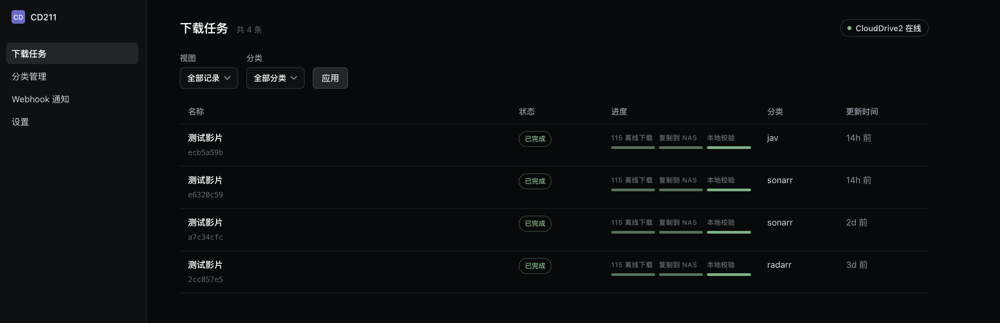

# CD211

[English](README_EN.md) | 简体中文

<p align="center">
  
</p>

## 让 Sonarr / Radarr 用上 115 云下载

CD211 提供兼容 qBittorrent Web API 的接口，可作为下载客户端接入 Sonarr 和 Radarr。它将磁力链接或 `.torrent` 文件交给 CloudDrive2，待 115 完成云下载后复制到 NAS 共享目录；本地校验通过后，才向 Sonarr / Radarr 报告完成。

你无需改变现有的媒体自动化流程，也不用再靠零散脚本串联下载、复制和导入。整个流程都可在 Web 界面中查看、重试和管理。

## 为什么选择 CD211

- **保留现有工作流**：在 Sonarr / Radarr 中将 CD211 添加为 qBittorrent 下载客户端即可。
- **文件就绪后再导入**：115 云下载、复制到 NAS、本地校验全部通过后，任务才会显示为完成。
- **问题看得见，也能处理**：集中查看任务进度、文件、历史和错误，并可开始、重试、取消或清理任务。
- **配置不用重启**：CloudDrive2、存储路径、超时、分类和密码均可在 Web 界面修改。
- **方便接入自动化**：提供原生 API、带签名的 Webhook、失败重试、死信和手动重新投递。
- **持久化与健康检查**：任务和设置存入 SQLite，并提供容器健康检查端点。

Web 界面支持简体中文和英文。

## 工作方式

```text
Sonarr / Radarr
      │  磁力链接或 .torrent
      ▼
    CD211 ──► CloudDrive2 ──► 115 云下载
      ▲                            │
      │      本地校验 ◄── NAS 复制 ◄┘
      │
      └── 文件确认就绪后报告完成
```

CD211 不是 BitTorrent 客户端，也不会做种。删除 CD211 中的任务不会删除其在 115 中的副本。

## 开始之前

你需要：

- 已挂载 115 且可通过 gRPC 访问的 CloudDrive2。
- Sonarr、Radarr，或需要调用 CD211 原生 API 的自动化程序。
- Docker Compose。
- CloudDrive2、CD211、Sonarr 和 Radarr 均可访问的 NAS 暂存目录。

> [!IMPORTANT]
> 四个容器必须将同一个宿主机暂存目录挂载到相同的绝对路径，容器内默认为 `/downloads`。CloudDrive2 创建的文件还必须对四个容器共用的用户组开放写权限。

```text
宿主机暂存目录 -> CloudDrive2: /downloads
              -> CD211:       /downloads
              -> Sonarr:      /downloads
              -> Radarr:      /downloads
```

CloudDrive2、CD211、Sonarr 和 Radarr 应使用同一个 `PGID`。使用 CloudDrive2 官方镜像时，请通过 `umask 0002` 启动，确保 CD211 能管理复制后的文件。

## 快速开始

### 1. 启动 CD211

```sh
mkdir -p cd211/downloads
cd cd211
curl -LO https://raw.githubusercontent.com/turygo/cd211/main/docker-compose.yml
docker compose up -d
```

默认配置会：

- 在 `8080` 端口提供 Web 界面。
- 将 SQLite 数据保存在 `cd211_data` 卷中。
- 将 `./downloads` 挂载为容器内的 `/downloads`。

如需指定运行用户和用户组，请在启动前创建 `.env`：

```dotenv
PUID=99
PGID=100
```

### 2. 完成首次设置

打开 `http://<cd211-host>:8080`，按向导完成：

1. 为固定用户名 `admin` 设置密码。密码至少 8 个字符，没有默认密码。
2. 填写 CloudDrive2 的 gRPC 地址、用户名、密码和 TLS 模式。
3. 选择 115 云下载根目录和 NAS 共享暂存根目录；共享暂存根目录的默认值为 `/downloads`。
4. 设置云下载、复制和本地校验超时。

可在向导中浏览或创建 CloudDrive2 目录和本地目录。完成设置后，向导会直接进入分类设置。

### 3. 注册分类

为 Sonarr / Radarr 使用的每个分类配置云端和本地子目录：

| 字段 | 电视剧示例 | 电影示例 |
|---|---|---|
| 分类名称 | `tv` | `movies` |
| 115 子目录 | `TV` | `Movies` |
| 暂存子目录 | `tv` | `movies` |
| 状态 | 已启用 | 已启用 |

如果 115 根目录是 `/115open/云下载`，共享暂存根目录是 `/downloads`，`tv` 分类将使用 `/115open/云下载/TV` 和 `/downloads/tv`，`movies` 分类将使用 `/115open/云下载/Movies` 和 `/downloads/movies`。

分类名称必须与 Sonarr / Radarr 中填写的值一致。修改根目录后，已有任务仍使用提交时确定的路径，新任务使用更新后的路径。

### 4. 接入 Sonarr / Radarr

打开 **Settings → Download Clients → Add → qBittorrent**：

| 字段 | 值 |
|---|---|
| Host | Sonarr / Radarr 可访问的 CD211 主机名或 IP 地址 |
| Port | `8080` |
| Use SSL | 默认关闭；仅在自建反向代理提供 TLS 时开启 |
| Username | `admin` |
| Password | 首次设置时创建的密码 |
| Category | 已在 CD211 中启用的分类，例如 `tv` 或 `movies` |

运行连接测试并保存。之后 Sonarr / Radarr 会像使用 qBittorrent 一样提交和跟踪任务。

### 5. 接入 ANI-RSS

在 CD211 Web 界面的**设置**页面生成 qBittorrent API 密钥。在 ANI-RSS 的下载设置中选择 qBittorrent，填写 CD211 地址，并将该 `qbt_` 密钥填入 qBittorrent 的“密码 / API 密钥”字段，然后运行连接测试。

文档、日志和截图中请使用 `qbt_<key>` 这样的占位符，不要写入真实凭据。

## 自动化能力

### qBittorrent Web API

`/api/v2` 接受持久化的 `SID` 会话 Cookie 或 `Authorization: Bearer qbt_<key>`。如果请求包含 `Authorization`，Bearer 认证优先；格式错误、未知或已撤销的 key 返回 `403`，不会回退到有效的 SID Cookie。没有该请求头时，服务检查 SID Cookie。

独立的 `qbt_` 密钥可在设置页面生成和撤销。SQLite 同时保存其明文、SHA-256 摘要和末尾提示，认证设置页需要显示明文；每次请求都会读取摘要，因此撤销会立即生效。该密钥只授权 `/api/v2`；`cd211_api_` 令牌只授权 `/api/v1`。

`/api/v2` 提供当前 ANI-RSS 所需的兼容子集：七个读接口同时接受 GET 和 POST；支持 `torrents/add`、`start`、标签、文件优先级、文件重命名、禁用自动管理及保存位置更新。该服务不是完整 qBittorrent，也不实现 BT 传输、做种、限速或 `/torrents/resume` 别名。

### 原生 API

在 Web 界面的**设置**页面生成以 `cd211_api_` 开头的全局自动化 API 令牌，然后使用 `Authorization: Bearer <cd211_api-token>` 调用 `/api/v1`：

| 端点 | 用途 |
|---|---|
| `POST /api/v1/downloads` | 提交磁力链接或种子文件 |
| `GET /api/v1/downloads/{hash}` | 查询任务状态 |
| `GET /api/v1/downloads/{hash}/wait` | 等待任务进入完成、失败、取消或删除状态 |
| `GET /api/v1/events` | 拉取下载完成和失败事件 |

可通过 JSON 提交磁力链接，也可通过 multipart 表单上传种子文件。事件接口使用不透明游标，事件可能重复投递；调用方应按事件 ID 去重。

自动化 API 令牌生成后明文会持久保存，并在每次进入设置页时显示；撤销后 API 停用。以 `cd211_api_` 开头的自动化 API 令牌只用于 `/api/v1`，不能用于 `/api/v2`；独立的 `qbt_` 密钥也不能用于 `/api/v1`。原生 API 不提供重试、取消或删除端点，这些操作请在 Web 界面完成。

### Webhook

CD211 可在下载完成或失败时发送带 HMAC-SHA256 签名的 Webhook。每个接收端点都可单独选择要接收的事件，并支持：

- 可选 Bearer 认证。
- 页面内测试投递。
- 最长 24 小时的指数退避重试。
- 死信记录和手动重新投递。
- 投递历史、状态筛选和错误信息脱敏。

接收方应使用原始请求体验证 `X-CD211-Signature`，并按 `X-CD211-Event-ID` 去重。

## 配置参考

### Docker Compose

| 设置 | 默认值 | 修改方式 |
|---|---:|---|
| HTTP 端口 | `8080` | 修改 `ports` 的宿主机端口 |
| 进程用户 | `PUID=99` | 在 `.env` 中设置 `PUID` |
| 进程用户组 | `PGID=100` | 在 `.env` 中设置 `PGID` |
| SQLite 存储 | `/data` 下的 `cd211_data` 卷 | 可改为宿主机本地目录 |
| 暂存目录 | `./downloads:/downloads` | 改为四个服务共同使用的宿主机目录 |

SQLite 数据库必须放在支持 POSIX 锁的宿主机本地文件系统中，不要将 `/data` 放在 NFS 或 SMB 上。

### 启动参数

| 参数 | 默认值 | 说明 |
|---|---|---|
| `--http-address` | `:8080` | HTTP 监听地址，格式为 `[host]:port` |
| `--database-path` | `/data/cd211.sqlite` | SQLite 数据库绝对路径 |

CD211 二进制文件不读取环境变量。`PUID` 和 `PGID` 仅由容器入口脚本用于降低进程权限。

### 应用设置

以下设置均可在 Web 界面修改并立即用于新任务：

- CloudDrive2 地址、用户名、密码和 TLS 模式。
- 115 云下载根目录和共享暂存根目录。
- 云下载超时（默认 `24h`）。
- NAS 复制超时（默认 `72h`）。
- 本地校验超时（默认 `10m`）。
- 分类、管理员密码、以 `cd211_api_` 开头的自动化 API 令牌、以 `qbt_` 开头的 qBittorrent API 密钥和 Webhook。

时长按 Go 格式填写，例如 `30m`、`24h` 或 `72h`。

## 安全与使用限制

- 仅在可信局域网中运行 CD211，不要把 HTTP 端口直接暴露到公网。
- Web 界面和 Sonarr / Radarr 可共用 `admin` 凭据；qBittorrent `/api/v2` 客户端也可使用独立的 `qbt_` 密钥。原生 `/api/v1` 只使用以 `cd211_api_` 开头的自动化 API 令牌。
- 两种 API 凭据均不会过期，也不适用于公网或多租户环境。
- CD211 不下载 BT 数据、不连接 Tracker、不做种，只负责协调 115 云下载、NAS 复制和状态回报。
- 删除任务不会删除 115 中的文件；删除时可自行选择是否同时删除本地文件。

## 健康检查

```text
GET /healthz
GET /readyz
```

`/healthz` 用于进程存活检查。首次设置完成且本地根目录可用后，`/readyz` 才会返回成功；在此之前，qBittorrent API 会返回 `503`。
