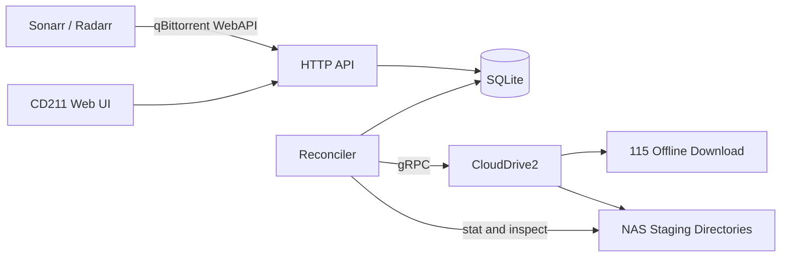
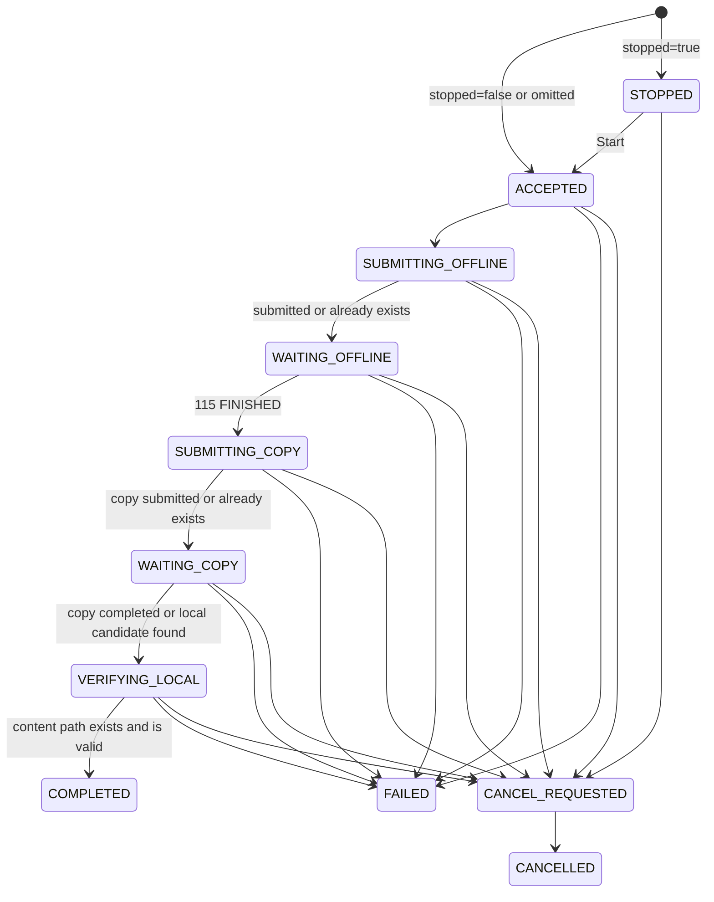

# CD211 Design

- Status: Draft
- Version: 0.2
- Date: 2026-08-06

## 1. Summary

CD211 is a qBittorrent WebAPI-compatible download client for Sonarr and Radarr. It translates torrent submissions into this workflow:

1. Submit a magnet to the 115 offline downloader through CloudDrive2.
2. Wait for the 115 offline task to finish.
3. Ask CloudDrive2 to copy the resulting content to a configured NAS staging directory.
4. Expose the download as completed only after the local content path is verified.
5. Keep the completed record visible until Sonarr or Radarr removes it.

CD211 is not a BitTorrent client and does not seed. qBittorrent is only the compatibility protocol presented to upstream applications.

The first release targets the qBittorrent API calls made by current Sonarr and Radarr versions. It does not attempt to emulate the complete qBittorrent API.

## 2. Problem

The existing 115 workflow is a thin asynchronous submission path backed by Redis and BullMQ. It can submit and monitor work, but it does not provide the durable, queryable download-client model required by Sonarr and Radarr:

- Sonarr and Radarr poll the download client for status; they do not require a completion callback.
- A completed item must remain queryable after the worker finishes.
- The client must expose an exact local `content_path` for import.
- Categories, deletion, restart recovery, failure state, and duplicate submissions need stable semantics.
- The existing queue removes successful jobs and therefore cannot be the authoritative download history.

CD211 makes the complete 115-to-NAS workflow one durable download-client service.

## 3. Goals

1. Pass the Sonarr and Radarr qBittorrent download-client connection tests.
2. Accept magnet links and uploaded `.torrent` files from Sonarr and Radarr.
3. Submit supported torrents to 115 through CloudDrive2.
4. Copy finished cloud content into a category-specific NAS staging directory.
5. Report a download as complete only when its local path exists and is safe to import.
6. Recover every non-terminal task after a process or NAS restart.
7. Handle duplicate submissions and crash windows idempotently.
8. Provide a small Web UI for status, errors, retry, cancellation, removal, and category configuration.
9. Run as one NAS container without Redis.

## 4. Non-goals

The first release will not:

- Implement BitTorrent peer transfer, seeding, ratios, tracker management, piece state, or bandwidth control.
- Implement the complete qBittorrent WebAPI.
- Support arbitrary qBittorrent desktop or mobile clients.
- Integrate directly with indexers or Prowlarr.
- Trigger Sonarr or Radarr import callbacks. Their normal polling and Completed Download Handling remain authoritative.
- Automatically blocklist failed releases in Sonarr or Radarr.
- Support v2-only torrents unless 115 and CloudDrive2 are verified to accept them.
- Provide multi-instance or distributed-worker operation.
- Require Redis, BullMQ, or a separate workflow engine.
- Delete the 115 cloud copy as an implicit side effect of qBittorrent `deleteFiles=true`.

## 5. Terminology

- **Upstream**: Sonarr, Radarr, or another caller of the qBittorrent-compatible API.
- **Offline task**: the 115 offline-download task exposed by CloudDrive2.
- **Copy task**: the CloudDrive2 task that copies cloud content to local NAS storage.
- **Save path**: the category staging root exposed as qBittorrent `save_path`.
- **Content path**: the exact local file or torrent root directory exposed as qBittorrent `content_path`.
- **Reconciler**: the in-process worker that advances durable downloads through the workflow.

## 6. Core Invariants

These invariants are correctness requirements:

1. `COMPLETED` means the local `content_path` has been verified. A finished 115 task is not sufficient.
2. `content_path` is generated by CD211 and must remain under the configured category `save_path`.
3. A canonical torrent info hash identifies at most one non-deleted download record.
4. API handlers persist intent before returning success. They do not depend on an in-memory queue.
5. Every external CloudDrive2 operation is safe to retry after an unknown result.
6. No database transaction remains open during a network or filesystem call.
7. Sonarr and Radarr can continue polling completed items until they explicitly remove them.
8. A category change after submission changes the label only; it does not silently relocate existing data.
9. Permanent workflow failure is never reported as completion.
10. Logs and the Web UI never expose tracker passkeys or raw authenticated URLs.

## 7. Architecture



CD211 is one process with four internal components:

### 7.1 HTTP API

- Implements the supported qBittorrent compatibility profile.
- Authenticates callers and validates inputs.
- Persists submissions, category changes, retries, cancellations, and removals.
- Never waits for a complete 115 or copy operation.

### 7.2 Reconciler

- Finds due non-terminal downloads in SQLite.
- Claims one transition with a short lease.
- Performs one bounded CloudDrive2 or filesystem operation.
- Persists the result and schedules the next transition.
- Recovers expired leases after a crash.

### 7.3 SQLite Store

- Authoritative source for categories and downloads.
- Opens SQLite through Go's `database/sql` and `modernc.org/sqlite` with one database connection.
- Uses `journal_mode=WAL`, `synchronous=FULL`, `foreign_keys=ON`, and a 5-second busy timeout.
- Uses SQL queries compiled by `sqlc`; there is no ORM.
- Applies ordered `goose` SQL migrations embedded in the application binary.
- Lives on a persistent local application-data mount. NFS and SMB mounts are not supported for the SQLite database.
- Is backed up only while the service is stopped or through an atomic filesystem snapshot that includes the database, `-wal`, and `-shm` files.

### 7.4 Web UI

- Reads the same durable state as the API.
- Uses Go's `html/template` with minimal client-side JavaScript.
- Does not require a separate SPA build, frontend package manager, or client-side state service.

### 7.5 Selected Implementation Stack

CD211 is implemented in Go 1.26.x. Release builds pin an exact supported Go patch version, use no CGO, and prefer the standard library where it already satisfies the contract.

| Concern | Selection |
|---|---|
| HTTP | `net/http` |
| Server-rendered UI | `html/template` and embedded static assets |
| SQLite | `database/sql` with `modernc.org/sqlite` |
| Query generation | `sqlc`, with generated Go code committed |
| Schema migrations | `goose` with embedded SQL migrations |
| CloudDrive2 gRPC | `grpc-go` and `google.golang.org/protobuf` generated client code |
| Torrent metadata | `github.com/anacrolix/torrent/metainfo` only; no peer-transfer client is started |
| Reconciliation | goroutines coordinated by `context.Context` and durable SQLite scheduling |
| Logging | standard-library `log/slog` structured JSON |
| Tests | standard-library `testing` and `httptest` with fake clocks and adapters |

The CloudDrive2 schema is vendored from `DDSRem-Dev/clouddrive2-client` commit `5c3124ff3e4bea1fef506057c53d0fb62e795759`, file `src/clouddrive2_client/proto/clouddrive.proto`. The source proto and its MIT license are stored with the project. Generated Go code is committed, and builds never download a schema from a moving branch.

The vendored proto declares custom schema version `1.0.0`, but that value is not proof of compatibility with a deployed CloudDrive2 server. Exact request, response, status, authentication, and cancellation behavior must pass the real CloudDrive2 contract check in Section 19.

Code-generation tools, including `sqlc`, `protoc-gen-go`, and `protoc-gen-go-grpc`, are version-pinned. The `anacrolix/torrent` dependency is used only for bencode and metainfo processing, and its MPL-2.0 obligations remain documented with release dependencies.

## 8. Deployment Model

The intended deployment is one Docker container. Release images are published for `linux/amd64` and `linux/arm64`:

```text
/data                       persistent SQLite database and service state
/downloads                  read-write NAS staging root
CloudDrive2:19798            outbound gRPC dependency
CD211 HTTP port              inbound from Sonarr, Radarr, and trusted LAN clients
```

Runtime configuration:

```text
CD211_USERNAME
CD211_PASSWORD
CD2_ADDRESS
CD2_USERNAME
CD2_PASSWORD
CD2_INSECURE=false
CD211_HTTP_ADDRESS=:8080
DATABASE_PATH=/data/cd211.sqlite
CLOUD_ROOT=/115open/云下载
LOCAL_ROOT=/downloads
CD211_OFFLINE_TIMEOUT=24h
CD211_COPY_TIMEOUT=72h
CD211_VERIFY_TIMEOUT=10m
PUID=99
PGID=100
```

CloudDrive2 transport uses certificate-verified TLS by default. `CD2_INSECURE=true` is an explicit opt-in for a trusted local deployment whose CloudDrive2 endpoint only supports plaintext gRPC.

Operational constraints:

- The service runs as a single replica.
- Release images support `linux/amd64` and `linux/arm64` without CGO.
- The SQLite database is on a persistent NAS-host-local filesystem with POSIX locking. NFS and SMB database mounts are unsupported because WAL requires same-host shared memory.
- Downloaded content is on persistent staging mounts.
- CD211 sends its own `savePath` string to CloudDrive2 as the copy destination, and CloudDrive2 resolves that string inside its own container. Both containers must therefore mount the same host staging directory at the same absolute path.
- Backups either stop the container or take an atomic snapshot of the complete SQLite file set.
- The HTTP API is not exposed directly to the public Internet.
- CloudDrive2 credentials remain in environment or secret mounts, not in SQLite.
- The entrypoint drops from root to `PUID:PGID` before starting the service, and only adjusts ownership of the `/data` and `/downloads` mount points themselves. The defaults `99:100` match the Synology `guest:users` pair; a deployment whose staging root belongs to another owner must set both.
- CD211 creates each category staging directory as mode `2770` owned by `PUID:PGID`. CloudDrive2, Sonarr, and Radarr must all run in the `PGID` group, because CloudDrive2 writes the copied content into that directory and the other two read it from there. A staging directory that already exists keeps the mode it has and must grant the same group access.
- Deleting a download removes a tree CloudDrive2 created, and POSIX requires write access on every directory in it. The setgid bit puts that content in the shared group, so CloudDrive2 must additionally run with umask `002` or `007`. The `cloudnas/clouddrive2` image runs as root with the default umask `022` and has no umask setting, so its entrypoint has to be wrapped: `["/bin/sh", "-c", "umask 0002; exec /clouddrive/clouddrive"]`. Without this, CD211 reports the qBittorrent `deleteFiles=true` cleanup as a blocked operator error and the staging directory keeps growing.
- The container `HEALTHCHECK` probes `/healthz`, which only depends on SQLite. An unreachable CloudDrive2 is reported through `/readyz` and never restarts the container.
- Release images are built by tag-triggered CI from source and published as `turygo/cd211:<version>` and `turygo/cd211:latest`. The build cross-compiles the binary on the runner's native architecture rather than emulating the Go toolchain.

The exact container network and firewall rule are deployment decisions, but the allowed flows must be limited to:

```text
Sonarr/Radarr -> CD211 HTTP
Trusted LAN   -> CD211 HTTP
CD211         -> CloudDrive2 gRPC
CD211         -> configured local staging mounts
```

## 9. Download State Machine

### 9.1 Internal States

```text
ACCEPTED
STOPPED
SUBMITTING_OFFLINE
WAITING_OFFLINE
SUBMITTING_COPY
WAITING_COPY
VERIFYING_LOCAL
COMPLETED
FAILED
CANCEL_REQUESTED
CANCELLED
DELETE_REQUESTED
DELETED
```

`FAILED`, `CANCELLED`, and `COMPLETED` are visible terminal states. `DELETED` is retained only for bounded internal cleanup and is not returned by `/torrents/info`.

### 9.2 Normal Flow



`DELETE_REQUESTED` can be entered from any visible state through the qBittorrent delete endpoint. The item is hidden from `/torrents/info` while cleanup progresses, then advances to `DELETED`. A blocked cleanup with an operator-visible error remains queryable and can be retried without discarding the original delete intent. This path is separate from the Web UI Cancel action, which preserves a visible `CANCELLED` record.

### 9.3 Transition Rules

#### `ACCEPTED -> SUBMITTING_OFFLINE`

The API has already persisted:

- canonical info hash;
- normalized submission magnet;
- category and frozen destination paths;
- parsed torrent metadata when available.

The transition is local and immediately due.

#### `SUBMITTING_OFFLINE -> WAITING_OFFLINE`

The reconciler calls CloudDrive2 `AddOfflineFiles`.

Both of these results are successful:

- a new task is accepted;
- CloudDrive2 or 115 reports that the task already exists.

Crash recovery checks the configured cloud folder for the same canonical info hash before resubmitting.

#### `WAITING_OFFLINE -> SUBMITTING_COPY`

The task is matched by canonical info hash inside its frozen cloud folder.

- `INIT` or `DOWNLOADING`: persist progress and poll later.
- `FINISHED`: persist the actual cloud task name and source path, then advance.
- `ERROR`: enter `FAILED` with the upstream error.
- Missing task: continue polling until the configured phase deadline.

There is no fallback to the newest offline item. That would associate concurrent downloads incorrectly.

#### `SUBMITTING_COPY -> WAITING_COPY`

The reconciler submits a copy from the persisted cloud source path to the frozen local save path.

Crash recovery first looks for an existing copy task with the same source path and destination path. An existing task is adopted instead of duplicated.

#### `WAITING_COPY -> VERIFYING_LOCAL`

- `Pending`, `Scanning`, or `Scanned`: persist copy progress and poll later.
- `Completed`: advance to local verification.
- `Failed`: enter `FAILED` with the copy error.
- Missing task: advance only when the expected local candidate exists; otherwise keep polling until the phase deadline.

A missing CloudDrive2 copy task is never sufficient evidence of success.

#### `VERIFYING_LOCAL -> COMPLETED`

CD211 resolves the candidate beneath the frozen save path and verifies:

- the path exists;
- it is a regular file or directory;
- its real path remains under the allowed staging root;
- it is not the category save root itself;
- the expected torrent root or single-file name matches the downloaded content.

The exact verified path is saved as `content_path`. Only then is the qBittorrent state reported as completed.

### 9.4 Retry and Timeout Policy

CloudDrive2 calls use a 30-second deadline. A claimed transition also has an operation deadline that ends before its durable lease, leaving a fixed margin for the CAS commit.

Transient transport failures use persisted exponential backoff:

```text
30 seconds -> 1 minute -> 2 minutes -> 4 minutes -> 5-minute cap
```

Normal status polling defaults to 15 seconds.

Default phase deadlines:

```text
Offline download: 24 hours
CloudDrive2 copy: 72 hours
Local verification: 10 minutes
```

These values are configured by `CD211_OFFLINE_TIMEOUT`, `CD211_COPY_TIMEOUT`, and `CD211_VERIFY_TIMEOUT`. Explicit 115 or copy errors fail immediately. A timeout enters `FAILED` with the last observed upstream state.

Manual Retry resumes from the earliest safe phase encoded by persisted upstream evidence; it does not blindly submit the whole workflow again. Cleanup failures preserve `CANCEL_REQUESTED` or `DELETE_REQUESTED` and Retry resumes that same cleanup intent.

## 10. qBittorrent State Projection

CD211 projects its richer workflow into qBittorrent's smaller status model:

| CD211 state | qBittorrent `state` | `progress` | Upstream meaning |
|---|---|---:|---|
| `ACCEPTED` | `queuedDL` | 0 | Queued |
| `STOPPED` | `stoppedDL` | 0 | Accepted but not started |
| `SUBMITTING_OFFLINE` | `metaDL` | 0 | Resolving/submitting metadata |
| `WAITING_OFFLINE` | `downloading` | 0.00-0.90 | Downloading |
| `SUBMITTING_COPY` | `moving` | 0.90 | Downloading |
| `WAITING_COPY` | `moving` | 0.90-0.99 | Downloading |
| `VERIFYING_LOCAL` | `moving` | 0.99 | Downloading |
| `COMPLETED` | `stoppedUP` | 1.00 | Completed and importable |
| `FAILED` | `error` | last value | Warning/manual intervention |
| `CANCEL_REQUESTED` | `stoppedDL` | last value | Paused during cancellation |
| `CANCELLED` | `stoppedDL` | last value | Cancelled |

The scalar qBittorrent progress is synthesized:

```text
WAITING_OFFLINE: 0.90 * offline_progress
WAITING_COPY:    0.90 + 0.09 * copy_progress
VERIFYING_LOCAL: 0.99
COMPLETED:       1.00
```

`offline_progress` and `copy_progress` remain separately visible in the CD211 Web UI.

Sonarr and Radarr treat qBittorrent `error` as a warning rather than guaranteed failed-download handling. CD211 must not claim automatic blocklisting or automatic release replacement.

## 11. qBittorrent Compatibility Profile

CD211 reports qBittorrent WebAPI version `2.11.0`. This implies support for the modern `stopped` add parameter and `stoppedUP`/`stoppedDL` state names.

All API routes require authentication except login and health checks.

### 11.1 Authentication

#### `POST /api/v2/auth/login`

Input: form fields `username` and `password`.

Success:

```text
HTTP 200
Set-Cookie: SID=<opaque-session-id>; Path=/; HttpOnly; SameSite=Lax; Secure=<when HTTPS>
Body: Ok.
```

The SID contains 256 bits generated by a cryptographically secure random source and carries no user or credential data. Session records live only in process memory, are bounded by TTL, and include revocation state and the Web UI CSRF token. A service restart invalidates all sessions, so `CD211_SESSION_SECRET` is not required. HTTPS responses mark the SID cookie `Secure`.

Invalid credentials return HTTP 200 with body `Fails.`. Five failures from one client address within five minutes create a 15-minute in-memory authentication ban; banned login attempts return HTTP 403. HTTP 403 is also used for an invalid authenticated session, matching qBittorrent behavior. Sonarr and Radarr reauthenticate after an authorization failure.

#### `POST /api/v2/auth/logout`

Invalidates the current session and returns HTTP 200.

### 11.2 Application API

#### `GET /api/v2/app/webapiVersion`

Returns plain text:

```text
2.11.0
```

#### `GET /api/v2/app/version`

Returns a synthetic, documented compatibility version such as:

```text
v5.0.0-cd211
```

#### `GET /api/v2/app/preferences`

Returns at least:

```json
{
  "save_path": "/downloads",
  "dht": true,
  "queueing_enabled": false,
  "max_ratio_enabled": false,
  "max_ratio": -1,
  "max_seeding_time_enabled": false,
  "max_seeding_time": -1,
  "max_inactive_seeding_time_enabled": false,
  "max_inactive_seeding_time": -1,
  "max_ratio_act": 0
}
```

`dht=true` prevents Sonarr and Radarr from rejecting trackerless magnets before submission. It is a compatibility capability flag, not a claim that CD211 runs a DHT node.

Queue priority is reported as unsupported because CD211 does not provide qBittorrent queue-order semantics.

### 11.3 Category API

#### `GET /api/v2/torrents/categories`

Returns a qBittorrent-compatible object:

```json
{
  "sonarr": {
    "name": "sonarr",
    "savePath": "/downloads/sonarr"
  },
  "radarr": {
    "name": "radarr",
    "savePath": "/downloads/radarr"
  }
}
```

#### `POST /api/v2/torrents/createCategory`

Accepts `category` and optional `savePath`.

When Sonarr or Radarr creates a category without `savePath`, CD211 derives deterministic defaults:

```text
cloud path = <CLOUD_ROOT>/<NORMALIZED_UPPERCASE_CATEGORY>
save path  = <LOCAL_ROOT>/<normalized-lowercase-category>
```

The Web UI can override both paths before downloads are submitted. A download freezes the resolved paths at add time.

Category names are validated. They cannot contain path traversal, control characters, or absolute paths.

CD211 resolves the evaluated canonical absolute `savePath` without changing the filesystem, then durably registers it as a disabled category before creating a missing directory through the local-root boundary. A destination conflict therefore returns before any filesystem side effect. Successful preparation enables the requested category; a filesystem failure leaves the disabled reservation in place for a safe retry. The resolved path must be a strict descendant of `LOCAL_ROOT`; symbolic-link escapes and the root itself are rejected.

#### `POST /api/v2/torrents/setCategory`

Updates the visible category label. Existing cloud, save, and content paths remain unchanged.

This supports Sonarr and Radarr post-import categories without moving already imported data.

### 11.4 Add Torrent

#### `POST /api/v2/torrents/add`

Supported inputs:

1. Form field `urls` containing one magnet URI.
2. Multipart field `torrents` containing one `.torrent` file.

Supported optional fields include:

```text
category
stopped
paused
contentLayout
ratioLimit
seedingTimeLimit
sequentialDownload
firstLastPiecePrio
```

Unsupported BitTorrent fields are accepted for compatibility but do not create seeding, piece-priority, or bandwidth behavior. `category`, `stopped`, and `paused` affect the durable workflow; seeding and piece-order fields are ignored and returned with their documented unsupported values.

The first release accepts one torrent per request. A request containing multiple items is rejected explicitly rather than partially applied.

The handler performs the following work before returning:

1. Parse and validate the input.
2. Derive the canonical v1 info hash.
3. Normalize the magnet used for 115 submission.
4. Resolve and freeze the category paths.
5. Insert a durable `ACCEPTED` record, or `STOPPED` when `stopped=true` or `paused=true`.

The record is committed before HTTP success. This makes `/torrents/properties` and `/torrents/info` immediately able to find the submitted hash.

A duplicate canonical hash is idempotent while its existing record has not been removed:

- The existing record is retained.
- No second 115 or copy operation is created.
- The API returns success so an upstream retry does not create a false grab failure.

After removal reaches `DELETED`, a new add may revive the row as a fresh submission. If previously retained local content passes the same path and torrent-root verification used by `VERIFYING_LOCAL`, the revived row starts at `VERIFYING_LOCAL`; otherwise it starts at `ACCEPTED` or `STOPPED`. A destination collision that cannot be safely adopted becomes an operator-visible failure.

Successful response:

```text
HTTP 200
Empty body
```

#### Torrent Parsing Requirements

For `.torrent` input, CD211 must:

- parse bencode without changing the encoded `info` dictionary bytes used for hashing;
- compute the SHA-1 v1 info hash;
- parse the display name and file list;
- collect announce and announce-list trackers;
- produce a normalized magnet containing `xt=urn:btih`, `dn`, and trackers;
- compute total size from the torrent metadata.

The Go adapter loads only an upload that has already passed the request-size limit, hashes the exact `metainfo.MetaInfo.InfoBytes`, and validates decoded file counts, path lengths, and aggregate sizes before persistence. It does not reconstruct the `info` dictionary for hashing and does not instantiate the torrent peer client.

For magnet input, CD211 must accept:

- 40-character hexadecimal v1 BTIH;
- 32-character Base32 v1 BTIH.

Both normalize to lowercase 40-character hexadecimal storage.

Hybrid v1/v2 torrents use their v1 hash. V2-only torrents are rejected with a clear error until the downstream 115 capability is verified.

Raw magnets and torrent-derived tracker URLs may contain private passkeys. They may be stored in the protected database for crash recovery but must be redacted from logs, API errors, and the Web UI.

### 11.5 List Torrents

#### `GET /api/v2/torrents/info`

Supports at least the `category` query parameter used by Sonarr and Radarr.

Each item returns at least:

```json
{
  "hash": "0123456789abcdef0123456789abcdef01234567",
  "name": "Example.Release",
  "size": 123456789,
  "progress": 0.95,
  "eta": 300,
  "state": "moving",
  "category": "sonarr",
  "save_path": "/downloads/sonarr/",
  "content_path": "",
  "ratio": 0,
  "ratio_limit": -1,
  "seeding_time": 0,
  "seeding_time_limit": -1,
  "inactive_seeding_time_limit": -1,
  "last_activity": 1785888000
}
```

Before `COMPLETED`, `content_path` is empty. At `COMPLETED`, it is the verified absolute file path for a single-file torrent or verified torrent-root directory for a multi-file torrent.

`save_path` is normalized as a directory path and must not equal the completed `content_path`.

When total size or transfer rate is unknown, `size` is `0` until metadata becomes available and `eta` is qBittorrent's unknown sentinel `8640000`. CD211 does not invent a transfer rate. Uploaded `.torrent` files provide size immediately; magnet submissions may remain size-unknown until CloudDrive2 exposes the finished source metadata.

### 11.6 Torrent Properties and Files

#### `GET /api/v2/torrents/properties?hash=<hash>`

Returns at least:

```json
{
  "hash": "0123456789abcdef0123456789abcdef01234567",
  "save_path": "/downloads/sonarr/",
  "seeding_time": 0
}
```

The endpoint must find a newly accepted torrent immediately because Sonarr or Radarr may query it shortly after add.

#### `GET /api/v2/torrents/files?hash=<hash>`

Returns parsed `.torrent` file names when available. Magnet submissions may return an empty array until downstream metadata is known. Modern Sonarr and Radarr import from `content_path`, so this endpoint is not the completion authority.

### 11.7 Delete Torrent

#### `POST /api/v2/torrents/delete`

Inputs:

```text
hashes=<hash or pipe-separated hashes>
deleteFiles=true|false
```

The API persists removal intent before returning HTTP 200.

`deleteFiles=false`:

- stops future reconciliation;
- cancels active CloudDrive2 work when possible;
- hides the record from `/torrents/info` after cancellation is durably requested;
- retains local files;
- retains the 115 cloud copy.

`deleteFiles=true` additionally removes the local staging content after validating its real path is beneath the frozen allowed save path.

Deleting the 115 cloud copy is a separate explicit CD211 action and is not implied by qBittorrent `deleteFiles`.

Local deletion must not follow a path outside the configured staging root. A failed safety check enters an operator-visible deletion error and leaves the content untouched.

### 11.8 Compatibility Mutation Endpoints

The following endpoints return success so supported Sonarr and Radarr settings do not fail:

```text
POST /api/v2/torrents/setShareLimits
POST /api/v2/torrents/topPrio
POST /api/v2/torrents/setForceStart
```

Semantics:

- `setShareLimits`: accepted and ignored; qBittorrent responses continue to report unlimited seeding because CD211 never seeds.
- `topPrio`: accepted but does not promise qBittorrent queue ordering.
- `setForceStart`: `value=true` advances `STOPPED` to `ACCEPTED`; other values do not pause active work or bypass configured concurrency and safety rules.

Unsupported qBittorrent endpoints return HTTP 404. They are not silently routed to unrelated behavior.

## 12. Durable Data Model

The logical schema is intentionally small.

### 12.1 `schema_migrations`

```text
version           integer primary key
applied_at        timestamp
```

### 12.2 `categories`

```text
name              text primary key
cloud_path        text not null
save_path         text not null
enabled           integer not null default 1
created_at        timestamp not null
updated_at        timestamp not null
```

Constraints:

- `cloud_path` must remain under the configured cloud root.
- `save_path` must remain under the configured local root.
- Path changes affect only future submissions.

### 12.3 `downloads`

```text
hash                       text primary key
name                       text not null
source_kind                text not null        -- magnet or torrent
submission_uri             text not null        -- protected, never returned
category                   text not null
cloud_folder               text not null        -- frozen at add time
save_path                  text not null        -- frozen at add time
destination_name           text                 -- durable live staging reservation
cloud_task_name            text
cloud_source_path          text
content_path               text
is_multi_file              integer
total_size                 integer
state                      text not null
offline_progress           real not null default 0
copy_progress              real not null default 0
qbit_progress              real not null default 0
last_upstream_status       text
last_error                 text
phase_started_at           timestamp not null
next_run_at                timestamp
lease_until                timestamp
lease_owner                text
attempt_count              integer not null default 0
delete_files_requested     integer not null default 0
created_at                 timestamp not null
updated_at                 timestamp not null
completed_at               timestamp
removed_at                 timestamp
row_version                integer not null default 0
```

`submission_uri` is required to recover a crash before the first confirmed 115 submission. The database file must be mode-restricted. API responses, logs, and UI views expose only a redacted source summary.

`(save_path, destination_name)` is unique for rows whose destination has been reserved and whose state is not `DELETED`. The reconciler persists this reservation after trusted metadata is available and before copy submission or local verification. A reserved destination may not contain a category save root or another retained download's save root, and a category save root may not be created inside a live reserved destination or retained local content. These database-enforced containment rules prevent one workflow's cleanup from owning another workflow's staging root. A conflicting row becomes `FAILED`. The unique reservation is released when removal reaches `DELETED`, while content retained by `deleteFiles=false` continues to exclude nested category roots.

### 12.4 `download_files`

```text
download_hash      text not null
file_index         integer not null
relative_path      text not null
size               integer not null
primary key (download_hash, file_index)
```

This table is populated from uploaded `.torrent` metadata and supports `/torrents/files` without reparsing the source.

## 13. Reconciliation and Crash Safety

### 13.1 Claim Pattern

The reconciler uses this pattern:

1. Begin a short SQLite write transaction.
2. Select one due non-terminal row without a live lease.
3. Set `lease_owner`, `lease_until`, and increment `row_version`.
4. Commit.
5. Perform one external operation.
6. Begin a new transaction.
7. Update only if the state and claimed row version still match.
8. Clear the lease and schedule the next run.
9. Commit.

A network call is never made while holding the database transaction.

An API cancellation or removal intent changes the state and row version immediately but preserves any live lease. The in-flight worker can no longer commit, while cleanup waits for that operation's bounded lease to expire before checking and cancelling the resulting upstream work.

### 13.2 Unknown-result Windows

#### Crash after offline submit, before database update

Recovery lists offline tasks in the frozen cloud folder and matches the canonical hash. It adopts the task or idempotently resubmits.

An `AlreadyExists` response is treated as accepted even if the immediately following task-list read is not yet consistent. The row enters the corresponding waiting state and polling adopts the task when it becomes visible.

#### Crash after copy submit, before database update

Recovery lists copy tasks and matches both source and destination. It adopts an existing copy task before submitting another.

#### Crash after local copy completes

Recovery verifies the expected local content and can complete the record even if CloudDrive2 already removed the finished copy task from its active list.

#### Crash after API add commit, before reconciler wake-up

The durable `ACCEPTED` record remains due and is processed after restart.

### 13.3 Concurrency

The first release supports one service process. Multiple downloads may be in flight, but each hash has one leased transition at a time.

The database unique key on canonical hash is the final duplicate-submission guard. A partial unique index on the reserved `(save_path, destination_name)` pair prevents different hashes from copying to or adopting the same staging entry. CloudDrive2 matching by hash and source/destination paths is the external idempotency guard.

## 14. Cancellation, Removal, and Cloud Retention

Cancellation and removal are separate concepts internally even though qBittorrent exposes them through delete operations.

- **Cancel** stops non-terminal work and keeps a visible `CANCELLED` record for operator inspection.
- **Remove** hides the item from the qBittorrent API and schedules bounded cleanup.
- **Delete local files** is allowed only for CD211-owned staging content below the frozen save path.
- **Delete cloud files**, if included in the first Web UI release, is a separate confirmed action outside qBittorrent compatibility semantics. Its inclusion remains a decision in Section 22.

The CloudDrive2 adapter must expose the underlying cancellation operations needed by this contract, including offline-task removal and copy-task cancellation/removal.

If cancellation cannot be confirmed because CloudDrive2 is unavailable, the durable cancellation request remains pending and the task never returns to normal workflow advancement.

Successful cancellation is recorded durably so a later removal does not repeat it. `deleteFiles=true` treats a cleared preflight or any submitted copy-task state as ownership evidence and idempotently removes the expected staging child, including partial copy output.

## 15. Failure Semantics

Failures are classified as follows:

| Class | Examples | Behavior |
|---|---|---|
| Input | invalid magnet, malformed torrent, v2-only torrent | Reject add request; no row committed |
| Configuration | category path invalid, local mount missing | Persist `FAILED`; operator must fix and retry |
| Upstream permanent | 115 status `ERROR`, copy status `Failed` | Persist `FAILED` immediately |
| Transient transport | deadline exceeded, connection refused | Backoff and retry from persisted state |
| Timeout | phase exceeds configured deadline | Persist `FAILED` with last observed state |
| Local verification | expected content absent or unsafe path | Retry during verification window, then fail |
| Deletion safety | resolved path outside allowed root | Do not delete; expose operator-visible error |

A failed record remains queryable and visible in the Web UI. Through the qBittorrent API it reports `state=error` until retried, cancelled, or removed.

Retry clears the current error, records a new phase start, and resumes from persisted evidence. It does not discard the canonical hash or create a parallel record.

Retrying an explicit offline or copy failure first removes or cancels the failed upstream task. A failed copy also deletes its safely reserved partial local candidate before preflight and resubmission; each cleanup step is durable and idempotent across crashes.

## 16. Web UI

The first Web UI contains three views.

### 16.1 Downloads

Columns:

```text
Name
Hash
Category
Phase
115 progress
Copy progress
qBittorrent state
Local content path
Age
Last error
```

Filters:

```text
Active
Completed
Failed
Cancelled
All
Category
```

Actions:

```text
Start
Retry
Cancel
Remove record
Remove record and local staging content
```

Destructive actions require explicit confirmation.

Explicit 115 cloud-copy deletion is not part of the baseline action set. If Section 22 includes it in the first release, it is added only to the detail view with a separate confirmation and exact persisted cloud-source-path validation.

### 16.2 Download Detail

Shows:

- normalized, redacted source type;
- immutable hash and frozen category paths;
- current internal state and projected qBittorrent state;
- last CloudDrive2 status;
- offline and copy progress;
- expected and verified local paths;
- timestamps, retry count, and last error.

Raw authenticated URLs and passkeys are never shown.

### 16.3 Categories

Allows operators to:

- create or disable categories;
- configure cloud and local paths;
- validate that paths remain under their allowed roots;
- see that edits apply only to future submissions.

## 17. Health and Operations

CD211 exposes service-native endpoints outside the qBittorrent namespace:

```text
GET /healthz    process and SQLite liveness
GET /readyz     migrations complete, database writable, local root available
```

CloudDrive2 availability is reported in the Web UI and readiness detail but does not make the HTTP service unavailable. Sonarr and Radarr must still be able to query durable state during a CloudDrive2 outage.

Logs are structured and include:

```text
download hash prefix
internal state
operation
attempt
latency
result
redacted error
```

Logs exclude:

```text
passwords
session identifiers
raw magnets
tracker passkeys
CloudDrive2 access tokens
```

## 18. Security

1. Every qBittorrent and Web UI route requires authentication except login and health checks.
2. Password comparison uses a password hash or a deployment secret; plaintext credentials are not stored in SQLite.
3. Session cookies contain only a cryptographically random opaque SID and are `HttpOnly`, `SameSite=Lax`, `Secure` on HTTPS, and bounded by TTL. Session state exists only in memory and is invalidated on restart.
4. Login failures are rate-limited by client address with bounded in-memory state and a temporary authentication ban.
5. Native Web UI state-changing forms require a per-session CSRF token; authenticated browser mutations must also be same-origin.
6. The API accepts only configured category paths and internally generated content paths.
7. Local deletion verifies containment and refuses a content tree containing any symbolic link.
8. Uploaded torrent size is bounded before parsing.
9. Torrent metadata parsing is deterministic and resource-bounded.
10. Error responses do not echo raw uploaded data or authenticated URLs.
11. The container has no access to media-library roots unless they are also intentional staging roots.
12. CD211 is deployed on trusted internal networks and is not a public reverse-proxy target.

## 19. Verification Strategy

Go tests use the standard `testing` package. HTTP contracts run through `httptest`; time, filesystem access, and CloudDrive2 operations sit behind explicit testable boundaries. SQLite tests use the same `modernc.org/sqlite` driver, embedded `goose` migrations, and `sqlc`-generated query layer as production.

### 19.1 API Contract Tests

Contract tests cover the actual Sonarr and Radarr call sequence:

1. Login and retain SID cookie.
2. Read WebAPI and application versions.
3. Read preferences.
4. Read or create the configured category.
5. List category torrents.
6. Add a magnet or torrent file.
7. Query properties immediately by hash.
8. Poll torrent info through every projected state.
9. Observe `stoppedUP`, `progress=1`, and a valid `content_path` only after local verification.
10. Change to a post-import category.
11. Delete with both `deleteFiles=false` and `deleteFiles=true`.

### 19.2 State-machine Tests

Use a fake clock, temporary SQLite database, fake filesystem root, and fake CloudDrive2 adapter to cover:

- normal magnet workflow;
- normal uploaded-torrent workflow;
- Base32 hash normalization;
- stopped add followed by Start;
- duplicate hash submission;
- re-add after completed removal;
- offline task already exists;
- copy task already exists;
- concurrent downloads with different hashes;
- missing offline task without unsafe fallback;
- missing copy task with and without verified local content;
- explicit offline and copy failures;
- transport backoff;
- phase timeout;
- restart at every state transition;
- cancellation during offline and copy phases;
- deletion containment and symlink escape rejection.
- concurrent destination reservation and release after removal;
- failed upstream task cleanup before resubmission;
- retained-content stopped re-add followed by Start;
- save-root symlink Verify-to-Delete round trips within the local root.

### 19.3 Integration Tests

A fake gRPC server generated from the vendored CloudDrive2 proto implements the exact methods used by CD211. It exercises request fields, authorization metadata, deadlines, status mapping, task matching, and unknown-result crash windows without requiring a live 115 account.

Because the proto source is third-party, a release candidate must also pass a controlled contract check against the supported production CloudDrive2 version. The check covers token acquisition, offline-task add/list/remove, copy submission/list/cancel/remove, and the file lookup operations used for recovery.

Before release, run these real-container checks:

- the controlled CloudDrive2 contract check succeeds;
- the `linux/amd64` and `linux/arm64` images start, migrate an empty database, and pass health checks;
- Sonarr download-client Test succeeds against CD211;
- Radarr download-client Test succeeds against CD211.

The end-to-end acceptance scenario uses a controlled torrent and verifies that the corresponding Completed Download Handling sees the expected local path.

## 20. Acceptance Criteria

The first release is complete when all of the following are true:

1. Sonarr and Radarr accept CD211 as a qBittorrent download client.
2. A magnet submission is immediately queryable by its canonical hash.
3. A v1 `.torrent` upload is parsed, converted, and submitted without requiring a public torrent URL.
4. A duplicate add does not create duplicate 115 or copy work.
5. Offline and copy progress remain distinguishable in the Web UI.
6. Sonarr and Radarr do not see a completed state before the local path is verified.
7. `content_path` points to the exact local file or torrent root and differs from `save_path`.
8. Restarting CD211 in every non-terminal state resumes the same task without starting over.
9. An explicit 115 or CloudDrive2 copy failure becomes a persistent visible error.
10. Delete without files retains local content.
11. Delete with files removes only safe content under the configured staging root.
12. The service runs without Redis or BullMQ.
13. The pinned CloudDrive2 proto passes the controlled contract check against the supported production CloudDrive2 version.
14. Both published container architectures start, migrate SQLite, and pass health checks.

## 21. Implementation Sequence

### Phase A: Durable Core

- Establish the Go 1.26 module, pinned code-generation tools, and multi-architecture container build.
- Configure `modernc.org/sqlite`, embedded `goose` migrations, and the `sqlc` query layer.
- Implement SQLite categories, downloads, and file metadata.
- Implement the reconciler claim and lease loop.
- Vendor the pinned CloudDrive2 proto and MIT license, then generate the Go gRPC client.
- Implement CloudDrive2 authentication, offline, copy, status, and cancellation operations against the generated client.

### Phase B: qBittorrent Compatibility

- Implement authentication and application endpoints with `net/http`.
- Implement categories.
- Implement magnet parsing and durable add.
- Implement info, properties, files, category changes, and deletion.
- Add Sonarr/Radarr request-sequence contract tests.

### Phase C: Torrent Files and Workflow Completion

- Build a resource-bounded adapter around `anacrolix/torrent/metainfo` and exact raw v1 info-hash calculation.
- Implement torrent-to-magnet normalization.
- Implement all reconciler transitions and crash recovery.
- Implement local path verification and safe deletion.

### Phase D: Web UI and Deployment

- Add `html/template` downloads, detail, and category views with embedded assets and minimal JavaScript.
- Add retry, cancel, and removal actions. Add explicit cloud deletion only if Section 22 includes it.
- Add health endpoints and structured redacted `log/slog` logging.
- Publish non-root `linux/amd64` and `linux/arm64` images and exercise the real Sonarr/Radarr integration scenario.

## 22. Remaining Decisions

The implementation stack and dependencies are selected in Section 7.5. Two product and deployment choices remain:

1. Exact category defaults for the production Sonarr and Radarr staging directories.
2. Whether explicit cloud deletion is included in the first UI release or deferred until after local deletion is proven safe.

These choices do not reopen the Go, HTTP, SQLite, migration, gRPC, torrent-metadata, session, or container-architecture selections.

## 23. References

- [qBittorrent 5.0+ WebUI API documentation](https://github.com/qbittorrent/qBittorrent/wiki/WebUI-API-%28qBittorrent-5.0%29)
- [Sonarr qBittorrent client](https://github.com/Sonarr/Sonarr/blob/develop/src/NzbDrone.Core/Download/Clients/QBittorrent/QBittorrent.cs)
- [Sonarr qBittorrent WebAPI v2 proxy](https://github.com/Sonarr/Sonarr/blob/develop/src/NzbDrone.Core/Download/Clients/QBittorrent/QBittorrentProxyV2.cs)
- [Radarr qBittorrent client](https://github.com/Radarr/Radarr/tree/develop/src/NzbDrone.Core/Download/Clients/QBittorrent)
- [Go release history](https://go.dev/doc/devel/release)
- [SQLite write-ahead logging](https://sqlite.org/wal.html)
- [`modernc.org/sqlite`](https://pkg.go.dev/modernc.org/sqlite)
- [`sqlc` SQLite guide](https://docs.sqlc.dev/en/stable/tutorials/getting-started-sqlite.html)
- [`goose` migrations](https://github.com/pressly/goose)
- [gRPC Go quick start](https://grpc.io/docs/languages/go/quickstart/)
- [Pinned CloudDrive2 proto](https://github.com/DDSRem-Dev/clouddrive2-client/blob/5c3124ff3e4bea1fef506057c53d0fb62e795759/src/clouddrive2_client/proto/clouddrive.proto)
- [`anacrolix/torrent` metainfo implementation](https://github.com/anacrolix/torrent/blob/master/metainfo/metainfo.go)
