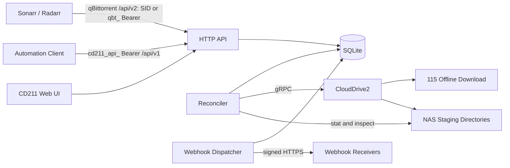
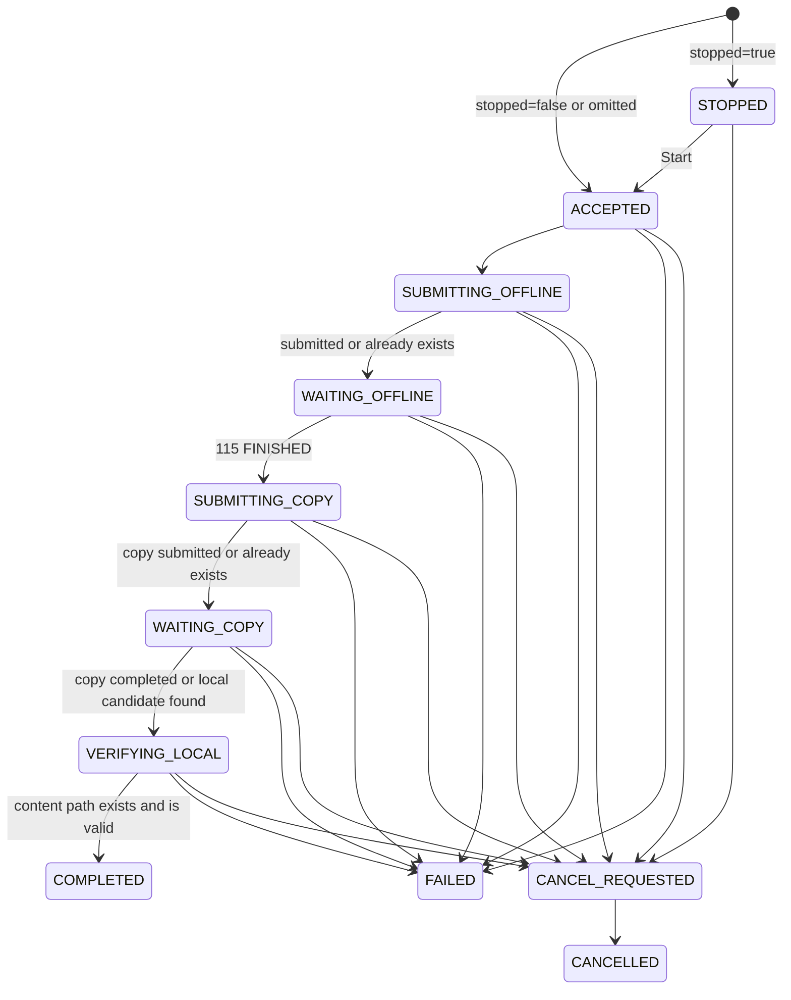

# CD211 Design

- Status: Draft
- Version: 0.2
- Date: 2026-08-06

## 1. Summary

CD211 is a qBittorrent WebAPI-compatible download client for Sonarr and Radarr. It translates torrent submissions into this workflow:

1. Submit a magnet to the 115 offline downloader through CloudDrive2.
2. Wait for the 115 offline task to finish.
3. Ask CloudDrive2 to copy the resulting content to a configured NAS staging directory.
4. Expose the download as completed only after the local content path is verified.
5. Keep the completed record visible until Sonarr or Radarr removes it.

CD211 is not a BitTorrent client and does not seed. qBittorrent is only the compatibility protocol presented to upstream applications.

On completion or failure, CD211 also emits signed outbound webhook notifications for external automation and monitoring. Events and their deliveries are committed transactionally with the download mutation and delivered by an independent in-process dispatcher; they are a notification channel and never replace the Sonarr/Radarr polling and import flow.

Alongside the qBittorrent-compatible surface, CD211 exposes a native automation API authenticated by a single system-generated `cd211_api_` Automation Token. The qBittorrent `/api/v2` surface instead accepts either its durable `SID` session cookie or an independent `qbt_` API key. The native API submits magnet and torrent downloads, queries durable download state, waits for a terminal outcome, and pulls completed and failed events; it performs no broad management or control actions. Automation consumers may use either surface, but credentials are scoped to one surface and are not interchangeable.

The first release targets the qBittorrent API calls made by current Sonarr and Radarr versions. It does not attempt to emulate the complete qBittorrent API.

## 2. Problem

The existing 115 workflow is a thin asynchronous submission path backed by Redis and BullMQ. It can submit and monitor work, but it does not provide the durable, queryable download-client model required by Sonarr and Radarr:

- Sonarr and Radarr poll the download client for status; they do not require a completion callback.
- A completed item must remain queryable after the worker finishes.
- The client must expose an exact local `content_path` for import.
- Categories, deletion, restart recovery, failure state, and duplicate submissions need stable semantics.
- The existing queue removes successful jobs and therefore cannot be the authoritative download history.

CD211 makes the complete 115-to-NAS workflow one durable download-client service.

## 3. Goals

1. Pass the Sonarr and Radarr qBittorrent download-client connection tests.
2. Accept magnet links and uploaded `.torrent` files from Sonarr and Radarr.
3. Submit supported torrents to 115 through CloudDrive2.
4. Copy finished cloud content into a category-specific NAS staging directory.
5. Report a download as complete only when its local path exists and is safe to import.
6. Recover every non-terminal task after a process or NAS restart.
7. Handle duplicate submissions and crash windows idempotently.
8. Provide a small Web UI for status, errors, retry, cancellation, removal, and category configuration.
9. Run as one NAS container without Redis.
10. Deliver signed, retryable outbound webhook notifications for completed and failed downloads from a transactional outbox, with per-endpoint subscriptions, dead-lettering, and manual replay.
11. Expose a native automation API — Bearer-token submission, status query, terminal wait, and a completed/failed event pull feed — alongside the qBittorrent compatibility surface.

## 4. Non-goals

The first release will not:

- Implement BitTorrent peer transfer, seeding, ratios, tracker management, piece state, or bandwidth control.
- Implement the complete qBittorrent WebAPI.
- Support arbitrary qBittorrent desktop or mobile clients.
- Integrate directly with indexers or Prowlarr.
- Trigger Sonarr or Radarr import callbacks. Their normal polling and Completed Download Handling remain authoritative; outbound domain webhooks (Section 7.5) are a separate notification channel and never act as an import trigger.
- Expose broad native management or control actions beyond the shipped submit, query, terminal-wait, and event-pull surface. The native API accepts submissions and reads state; it does not retry, cancel, delete, or mutate categories, and events are pulled out, never delivered inbound.
- Provide a public-webhook SSRF allowlist or block private/LAN receiver URLs. Receiver URLs are operator-configured and trusted by design.
- Automatically blocklist failed releases in Sonarr or Radarr.
- Support v2-only torrents unless 115 and CloudDrive2 are verified to accept them.
- Provide multi-instance or distributed-worker operation.
- Require Redis, BullMQ, or a separate workflow engine.
- Delete the 115 cloud copy as an implicit side effect of qBittorrent `deleteFiles=true`.

## 5. Terminology

- **Upstream**: Sonarr, Radarr, or another caller of the qBittorrent-compatible API.
- **Offline task**: the 115 offline-download task exposed by CloudDrive2.
- **Copy task**: the CloudDrive2 task that copies cloud content to local NAS storage.
- **Save path**: the category staging root exposed as qBittorrent `save_path`.
- **Content path**: the exact local file or torrent root directory exposed as qBittorrent `content_path`.
- **Reconciler**: the in-process worker that advances durable downloads through the workflow.
- **Outbox**: the durable `domain_events` table into which domain events are written in the same transaction as the download mutation that produced them.
- **Webhook endpoint**: an operator-configured named receiver URL with its own signing secret and optional bearer token.
- **Webhook dispatcher**: the in-process worker that fans outbox events out to subscribed webhook endpoints.
- **Dead-letter**: a webhook delivery that exhausted its retry window and awaits operator replay.

## 6. Core Invariants

These invariants are correctness requirements:

1. `COMPLETED` means the local `content_path` has been verified. A finished 115 task is not sufficient.
2. `content_path` is generated by CD211 and must remain under the configured category `save_path`.
3. A canonical torrent info hash identifies at most one non-deleted download record.
4. API handlers persist intent before returning success. They do not depend on an in-memory queue.
5. Every external CloudDrive2 operation is safe to retry after an unknown result.
6. No database transaction remains open during a network or filesystem call.
7. Sonarr and Radarr can continue polling completed items until they explicitly remove them.
8. A category change after submission changes the label only; it does not silently relocate existing data.
9. Permanent workflow failure is never reported as completion.
10. Logs and the Web UI never expose tracker passkeys or raw authenticated URLs.
11. A domain event and its matching delivery fan-out are committed in the same transaction as the download mutation that produced them; fan-out never blocks or delays the mutation.
12. Webhook delivery is at-least-once. Consumers must deduplicate by event ID, and replay reuses the original event ID and payload.
13. Webhook receiver URLs, signing secrets, and request bodies are never written to logs.
14. A webhook receiver URL must be an absolute HTTP/HTTPS URL without userinfo or fragment. Query strings are allowed and delivered to the receiver, but raw query values are redacted from ordinary Web UI reads and edit forms. Redirects are never followed.

## 7. Architecture



CD211 is one process with six internal components:

### 7.1 HTTP API

- Implements the supported qBittorrent compatibility profile.
- Authenticates callers with credentials scoped to either `/api/v2` or `/api/v1`, then validates inputs.
- Persists submissions, category changes, retries, cancellations, and removals.
- The qBittorrent compatibility profile accepts GET and POST for `app/webapiVersion`, `app/version`, `app/preferences`, `torrents/categories`, `torrents/info`, `torrents/properties`, and `torrents/files`. The supported ANI-RSS mutations persist tags, task names, file priorities and renames, start stopped tasks, disable automatic management, and update pristine save locations. Unsupported transfer controls and `/torrents/resume` remain unavailable.
- Never waits for a complete 115 or copy operation.

### 7.2 Reconciler

- Finds due non-terminal downloads in SQLite.
- Claims one transition with a short lease.
- Performs one bounded CloudDrive2 or filesystem operation.
- Persists the result and schedules the next transition.
- Recovers expired leases after a crash.

### 7.3 SQLite Store

- Authoritative source for categories and downloads.
- Opens SQLite through Go's `database/sql` and `modernc.org/sqlite` with one database connection.
- Uses `journal_mode=WAL`, `synchronous=FULL`, `foreign_keys=ON`, and a 5-second busy timeout.
- Uses SQL queries compiled by `sqlc`; there is no ORM.
- Applies ordered `goose` SQL migrations embedded in the application binary.
- Lives on a persistent local application-data mount. NFS and SMB mounts are not supported for the SQLite database.
- Is backed up only while the service is stopped or through an atomic filesystem snapshot that includes the database, `-wal`, and `-shm` files.

### 7.4 Web UI

- Reads the same durable state as the API.
- Uses Go's `html/template` with minimal client-side JavaScript.
- Does not require a separate SPA build, frontend package manager, or client-side state service.

### 7.5 Outbox and Webhook Dispatcher

- Writes a domain event and its matching delivery fan-out into SQLite in the same transaction as the download mutation that produced them. Fan-out never blocks or delays the mutation path.
- The dispatcher runs as an independent in-process worker after setup completes; no deployment flag, extra service, or environment variable enables it. Endpoint enabled state and subscriptions control fan-out, and new endpoints may be created enabled or disabled.
- Claims due deliveries with a short 30-second lease and CAS row-version checks; runs four workers with a 10-second request timeout. Only a 2xx response counts as success, and no database transaction spans an HTTP attempt.
- Retries failures with bounded exponential backoff for up to 24 hours, then dead-letters the delivery. Manual replay reopens the same `(event_id, endpoint_id)` row for an enabled, non-deleted endpoint, preserving the event ID and payload, resetting attempts/lease/error state, and starting a fresh 24-hour window without creating a duplicate row.
- Enforces per-endpoint and aggregate delivery ordering. Only `download.completed` and `download.failed` fan out in this release; `download.created`, `download.state_changed`, and `download.category_changed` events are durable history only. `webhook.test` events are targeted solely at the selected endpoint.
- Process shutdown cancels workers before the store closes; an interrupted attempt leaves its lease to expire and be reclaimed.

### 7.6 Native Automation API

- Mounted at `/api/v1` in the configured runtime. The setup-mode mux answers every `/api/v1/*` path with an unauthenticated JSON 503 until first-run setup completes.
- Authentication is the single system-generated global `cd211_api_` Automation Token, read from the store on every request so generation and revocation apply immediately. Only `Authorization: Bearer <cd211_api_ token>` is accepted; `qbt_` keys, SID cookies, and the admin password are ignored. The authenticated Settings page displays the persisted plaintext on every visit; token material is never logged.
- `POST /api/v1/downloads` accepts a strict JSON magnet body `{magnet, category, stopped}` or a multipart form with a `torrent` file plus `category`/`stopped`, through the same shared submission service as the qBittorrent adapter (Section 11.4). New and revived submissions answer 201 with a `Location` header; an existing active row answers 200 unchanged. The body is `{created, download}`.
- `GET /api/v1/downloads/{hash}` returns the query model: persisted uppercase state, projected progress, `row_version` as version, terminal/outcome mapping, sanitized error, timestamps, content path, and `links`. Additive nullable `error_code` and `next_retry_at` fields carry the durable problem code and the scheduled retry time when present; existing response semantics remain compatible. A `DELETED` row remains queryable; a never-existing hash is 404. `submission_uri`, raw sources, tracker passkeys, and cloud credentials are never exposed.
- `GET /api/v1/downloads/{hash}/wait?timeout=1s..25s` is terminal-only: it answers 200 with the model once the download reaches `COMPLETED`, `FAILED`, `CANCELLED`, or `DELETED`, and 204 with the `X-CD211-Download-Version` header on timeout or runtime shutdown. `STOPPED` and all request/in-progress states stay non-terminal. Waiters observe the process-owned event signal (Section 7.5) without holding a database transaction.
- `GET /api/v1/events` pulls `download.completed` and `download.failed` events with strict `cursor`/`types`/`hash`/`limit`/`wait` parameters. The cursor is an opaque base64url versioned cursor over the monotonic `domain_events.sequence`; omitting it starts at the oldest retained event and the literal `latest` starts after the current high-water. Each scan snapshots the signal, reads the high-water, and lists matching rows with index-backed queries; pages are `{items, next_cursor, has_more}` and advance over hidden types without rescanning. Delivery is at-least-once and the immutable event ID is the idempotency key; failed-event errors are sanitized, including frozen paths. `wait` long-polls up to 25s on the shared signal.
- The native surface has no control endpoints: it does not retry, cancel, delete, or mutate categories, and no events are delivered inbound. Like the rest of the service it is for trusted-LAN deployments; long polls share the single-token deployment boundary and provide no public or multi-tenant abuse resistance.

### 7.7 Selected Implementation Stack

CD211 is implemented in Go 1.26.x. Release builds pin an exact supported Go patch version, use no CGO, and prefer the standard library where it already satisfies the contract.

| Concern | Selection |
|---|---|
| HTTP | `net/http` |
| Server-rendered UI | `html/template` and embedded static assets |
| SQLite | `database/sql` with `modernc.org/sqlite` |
| Query generation | `sqlc`, with generated Go code committed |
| Schema migrations | `goose` with embedded SQL migrations |
| CloudDrive2 gRPC | `grpc-go` and `google.golang.org/protobuf` generated client code |
| Torrent metadata | `github.com/anacrolix/torrent/metainfo` only; no peer-transfer client is started |
| Reconciliation | goroutines coordinated by `context.Context` and durable SQLite scheduling |
| Logging | standard-library `log/slog` structured JSON |
| Tests | standard-library `testing` and `httptest` with fake clocks and adapters |

The CloudDrive2 schema is vendored from `DDSRem-Dev/clouddrive2-client` commit `5c3124ff3e4bea1fef506057c53d0fb62e795759`, file `src/clouddrive2_client/proto/clouddrive.proto`. The source proto and its MIT license are stored with the project. Generated Go code is committed, and builds never download a schema from a moving branch.

The vendored proto declares custom schema version `1.0.0`, but that value is not proof of compatibility with a deployed CloudDrive2 server. Exact request, response, status, authentication, and cancellation behavior must pass the real CloudDrive2 contract check in Section 19.

Code-generation tools, including `sqlc`, `protoc-gen-go`, and `protoc-gen-go-grpc`, are version-pinned. The `anacrolix/torrent` dependency is used only for bencode and metainfo processing, and its MPL-2.0 obligations remain documented with release dependencies.

## 8. Deployment Model

The intended deployment is one Docker container. Release images are published for `linux/amd64` and `linux/arm64`:

```text
/data                       persistent SQLite database and service state
/downloads                  read-write NAS staging root
CloudDrive2:19798            outbound gRPC dependency
CD211 HTTP port              inbound from Sonarr, Radarr, and trusted LAN clients
```

Bootstrap command-line flags (read once at startup; the binary reads no environment variables):

```text
--http-address=:8080
--database-path=/data/cd211.sqlite
```

The container-level identity pair `PUID`/`PGID` is not read by the binary either; the entrypoint consumes it to drop privileges before `exec su-exec "$PUID:$PGID" "$@"`.

Every other runtime setting — the CloudDrive2 connection, the cloud and local roots, and the phase timeouts — is configured in the first-run web setup wizard or the Settings page and persisted in the SQLite `settings` table (Section 8.1).

The operator username for the Web UI and the qBittorrent-compatible API is fixed to `admin`. The password is chosen during first-run setup — there is no default password — and can be changed from the Web UI afterwards; the current password hash is persisted in SQLite. This is a trusted-LAN appliance; the HTTP port must never be exposed to the public Internet (Section 8 operational constraints). Until setup completes the service answers only the setup wizard, so anyone on the LAN can claim the instance; the password should be set as soon as the container starts.

CloudDrive2 transport uses certificate-verified TLS by default. The insecure opt-in (`cd2.insecure`) is set in the wizard or the Settings page, for a trusted local deployment whose CloudDrive2 endpoint only supports plaintext gRPC.

Operational constraints:

- The service runs as a single replica.
- Release images support `linux/amd64` and `linux/arm64` without CGO.
- The SQLite database is on a persistent NAS-host-local filesystem with POSIX locking. NFS and SMB database mounts are unsupported because WAL requires same-host shared memory.
- Downloaded content is on persistent staging mounts.
- CD211 sends its own `savePath` string to CloudDrive2 as the copy destination, and CloudDrive2 resolves that string inside **its own virtual filesystem**, not inside its container. That virtual root holds the mounted cloud drives plus the local directories CloudDrive2 has been configured to expose, so a path that exists in the CloudDrive2 container is still rejected unless it is also one of those entries. The staging root must therefore be mounted into CD211 at the exact absolute path CloudDrive2 exposes: if CloudDrive2 exposes the staging tree as `/bt`, CD211 mounts that same host directory at `/bt` and sets the local root to `/bt`. Verify with `FindFileByPath` before deploying rather than assuming the container path works.
- Backups either stop the container or take an atomic snapshot of the complete SQLite file set.
- The HTTP API is not exposed directly to the public Internet.
- Outbound webhook delivery runs inside the same single process after setup completes; there is no separate service or deployment flag. Receiver URLs are operator-configured HTTP/HTTPS targets, redirects are never followed, and private/LAN addresses are intentionally allowed — CD211 provides no public-webhook SSRF allowlist, so only trusted URLs should be configured.
- CloudDrive2 credentials are stored in the SQLite `settings` table (Section 8.1); the operator password exists only as a PBKDF2-SHA256 hash.
- The entrypoint drops from root to `PUID:PGID` before starting the service, and only adjusts ownership of the `/data` and `/downloads` mount points themselves. The defaults `99:100` match the Synology `guest:users` pair; a deployment whose staging root belongs to another owner must set both.
- CD211 creates each category staging directory as mode `2770` owned by `PUID:PGID`. CloudDrive2, Sonarr, and Radarr must all run in the `PGID` group, because CloudDrive2 writes the copied content into that directory and the other two read it from there. A staging directory that already exists keeps the mode it has and must grant the same group access.
- Deleting a download removes a tree CloudDrive2 created, and POSIX requires write access on every directory in it. The setgid bit puts that content in the shared group, so CloudDrive2 must additionally run with umask `002` or `007`. The `cloudnas/clouddrive2` image runs as root with the default umask `022` and has no umask setting, so its entrypoint has to be wrapped: `["/bin/sh", "-c", "umask 0002; exec /clouddrive/clouddrive"]`. Without this, CD211 reports the qBittorrent `deleteFiles=true` cleanup as a blocked operator error and the staging directory keeps growing.
- The container `HEALTHCHECK` probes `/healthz`, which only depends on SQLite. An unreachable CloudDrive2 is reported through `/readyz` and never restarts the container.
- Images are built by CI from source, and the build cross-compiles the binary on the runner's native architecture rather than emulating the Go toolchain. A push to `main` publishes `turygo/cd211:dev`. A `v*` tag publishes `turygo/cd211:<version>` and, once the images are pushed, creates the matching GitHub release. A tag also moves `turygo/cd211:latest` unless it is a pre-release or a backport below an existing higher release.

The exact container network and firewall rule are deployment decisions, but the allowed flows must be limited to:

```text
Sonarr/Radarr -> CD211 HTTP
Trusted LAN   -> CD211 HTTP
CD211         -> CloudDrive2 gRPC
CD211         -> configured local staging mounts
CD211         -> configured webhook receiver URLs
```

### 8.1 First-run setup and runtime configuration

Service configuration is split into two layers:

- **Bootstrap** — command-line flags, parsed once at startup: `--http-address` and `--database-path` (Section 8). The container-level `PUID`/`PGID` are entrypoint-only.
- **Runtime settings** — web-configured, persisted in SQLite: the CloudDrive2 connection, the cloud and local roots, and the phase timeouts.

Runtime settings live in a single key-value table:

```text
settings(key TEXT PRIMARY KEY, value TEXT NOT NULL, updated_at TIMESTAMP NOT NULL)
```

| Key | Meaning |
|-----|---------|
| `cd2.address` | CloudDrive2 gRPC endpoint `host:port` |
| `cd2.username` | CloudDrive2 account |
| `cd2.password` | CloudDrive2 password |
| `cd2.insecure` | `"true"` \| `"false"`; opt-in for plaintext gRPC without TLS |
| `paths.cloud_root` | 115 offline-download root as seen by CloudDrive2; category cloud paths are descendants built from this root and a UI-managed relative subpath |
| `paths.local_root` | Shared staging root visible at the same absolute path to CloudDrive2, CD211, Sonarr, and Radarr; category save paths are descendants built from this root and a UI-managed relative subpath |
| `timeouts.offline` | Max time for one 115 offline task (default `24h`) |
| `timeouts.copy` | Max time for one CloudDrive2 copy task (default `72h`) |
| `timeouts.verify` | Max time for local verification (default `10m`) |
| `setup.completed_at` | RFC3339 UTC timestamp; written last in the same transaction, and its presence is the definition of a completed setup |

The CloudDrive2 password is stored plaintext in this table. The CloudDrive2 API authenticates with the credential directly and offers no token or hash exchange, so a one-way hash would be unusable; the table lives on the same trusted-LAN host as the rest of the database. The operator password is not stored here — it exists only as a PBKDF2-SHA256 hash (Section 12.5).

**Startup state machine.** At boot, CD211 loads the settings and switches on `setup.completed_at`:

- **Absent** — setup mode. The HTTP root serves the wizard routes (`/setup` and its POST endpoints), `/healthz` returns 200, `/readyz` and every `/api/v2/*` route return 503 with a plain-text body, and every other path redirects to `/setup`. There is no fallback to other configuration sources and no default password.
- **Present and valid** — the full runtime is built from the stored values and installed as the HTTP root.
- **Present but invalid** — a startup error; CD211 exits instead of silently falling back to setup mode.

**In-process hot swap.** The HTTP root is held in an atomic handler pointer; swapping it takes no locks. Every settings save — the wizard's finish step or the Settings page — persists first, then rebuilds the whole runtime generation (CloudDrive2 client, reconciler coordinator, webhook dispatcher, credentials, HTTP API, Web UI, health mux) and installs it with one atomic store. The previous generation's coordinator is cancelled and awaited, and its CloudDrive2 client is closed; the process-owned session service and SQLite store are shared across generations. Session records therefore survive both hot swaps and process restarts that reopen the same database, while logout revocation remains durable. No restart is involved in a hot swap, and an old generation never keeps serving requests after the swap.

**Wizard steps** (served only in setup mode):

1. **Operator password** — the first visitor creates the `admin` password (minimum 8 characters). It is hashed immediately and held in memory, and a session is created; every later step requires that session.
2. **CloudDrive2 connection** — address, username, password, and the insecure toggle, with an in-page connectivity test that distinguishes network unreachability/timeout, TLS failure (with a hint to try insecure), authentication failure, and other errors.
3. **File flow** — the 115 offline-download root is tested as an existing CloudDrive2 directory; the shared staging root is validated through the local-root boundary and a probe-file create/delete round trip. The UI presents them as the source and destination of one copy flow rather than unrelated paths.
4. **Timeouts** — optional offline, copy, and verify phase deadlines.

`POST /setup/finish` re-runs every test server-side (never trusting the client's earlier results), then persists the password hash and all settings in one transaction with `setup.completed_at` written last, builds and hot-swaps the full runtime, and redirects to `/categories?onboarding=1`.

**Settings page** (authenticated, normal mode). `GET /settings` shows the current values and previews each category under both roots; `POST /settings/test` re-runs the connectivity and path tests; `POST /settings/save` re-tests server-side, preserves each category's relative subpaths, prepares the remapped shared staging directories, and persists settings plus remapped full category paths atomically through `ReplaceSettingsAndCategories`. It then applies the new generation through the same hot-swap path. If the apply fails, the saved settings remain persisted and take effect on the next restart. A blank CloudDrive2 password field keeps the stored value. Existing downloads retain their frozen paths and no files are moved.

## 9. Download State Machine

### 9.1 Internal States

```text
ACCEPTED
STOPPED
SUBMITTING_OFFLINE
WAITING_OFFLINE
SUBMITTING_COPY
WAITING_COPY
VERIFYING_LOCAL
COMPLETED
FAILED
CANCEL_REQUESTED
CANCELLED
DELETE_REQUESTED
DELETED
```

`FAILED`, `CANCELLED`, and `COMPLETED` are visible terminal states. `DELETED` is retained only for bounded internal cleanup and is not returned by `/torrents/info`.

### 9.2 Normal Flow



`DELETE_REQUESTED` can be entered from any visible state through the qBittorrent delete endpoint. The item is hidden from `/torrents/info` while cleanup progresses, then advances to `DELETED`. A blocked cleanup with an operator-visible error remains queryable and can be retried without discarding the original delete intent. This path is separate from the Web UI Cancel action, which preserves a visible `CANCELLED` record.

### 9.3 Transition Rules

#### `ACCEPTED -> SUBMITTING_OFFLINE`

The API has already persisted:

- canonical info hash;
- normalized submission magnet;
- category and frozen destination paths;
- parsed torrent metadata when available.

The transition is local and immediately due.

#### `SUBMITTING_OFFLINE -> WAITING_OFFLINE`

The reconciler calls CloudDrive2 `AddOfflineFiles`.

Both of these results are successful:

- a new task is accepted;
- CloudDrive2 or 115 reports that the task already exists.

Crash recovery checks the configured cloud folder for the same canonical info hash before resubmitting.

#### `WAITING_OFFLINE -> SUBMITTING_COPY`

The task is matched by canonical info hash inside its frozen cloud folder.

- `INIT` or `DOWNLOADING`: persist progress and poll later.
- `FINISHED`: persist the actual cloud task name and source path, then advance.
- `ERROR`: enter `FAILED` with the upstream error.
- Missing task: continue polling until the configured phase deadline.

There is no fallback to the newest offline item. That would associate concurrent downloads incorrectly.

#### `SUBMITTING_COPY -> WAITING_COPY`

The reconciler submits a copy from the persisted cloud source path to the frozen local save path.

Crash recovery first looks for an existing copy task with the same source path and destination path. An existing task is adopted instead of duplicated.

The destination name is reserved once the finished offline task supplies the safe name; the reservation no longer requires file metadata, because magnet submissions only learn their file-vs-folder shape from the verified local copy. Pre-copy collision detection clears the reserved destination first: uploaded torrents keep strict expected verification, while a magnet treats any safe existing regular file or directory at the destination as a collision regardless of type.

Copy submission is operation-aware: temporary transport, authentication, not-found, and rejected observations keep the download non-terminal and schedule the persisted exponential backoff, while invalid input and invalid responses fail immediately with an actionable structured problem. An explicit upstream `CopyTask` state `FAILED` is terminal immediately.

#### `WAITING_COPY -> VERIFYING_LOCAL`

- `Pending`, `Scanning`, or `Scanned`: persist copy progress and poll later.
- `Completed`: advance to local verification.
- `Failed`: enter `FAILED` with the copy error.
- Missing task: advance only when the expected local candidate exists; otherwise keep polling until the phase deadline.

A missing CloudDrive2 copy task is never sufficient evidence of success.

#### `VERIFYING_LOCAL -> COMPLETED`

CD211 resolves the candidate beneath the frozen save path and verifies:

- the path exists;
- it is a regular file or directory;
- its real path remains under the allowed staging root;
- it is not the category save root itself;
- the expected torrent root or single-file name matches the downloaded content.

The exact verified path is saved as `content_path`. Only then is the qBittorrent state reported as completed. Uploaded torrents verify against their persisted expected kind; a magnet has no expected kind, so the same root-confined, symlink-rejecting check accepts only a regular file or a directory and persists the observed `is_multi_file`, measured size, and content path before completing.

### 9.4 Retry and Timeout Policy

CloudDrive2 calls use a 30-second deadline. A claimed transition also has an operation deadline that ends before its durable lease, leaving a fixed margin for the CAS commit.

Transient transport failures use persisted exponential backoff:

```text
30 seconds -> 1 minute -> 2 minutes -> 4 minutes -> 5-minute cap
```

Normal status polling defaults to 15 seconds.

Default phase deadlines:

```text
Offline download: 24 hours
CloudDrive2 copy: 72 hours
Local verification: 10 minutes
```

These values are configured in the setup wizard and the Settings page (`timeouts.offline`, `timeouts.copy`, `timeouts.verify`; Section 8.1). An explicit 115 failure or an explicit `CopyTask` `FAILED` enters `FAILED` immediately; copy submission readiness and rejection are bounded retries within the copy deadline. A timeout enters `FAILED` with a terminal problem code derived from the last durable retry observation, so a sustained not-ready, unreachable, or authentication condition does not degrade to a generic timeout.

Manual Retry resumes from the earliest safe phase encoded by persisted upstream evidence; it does not blindly submit the whole workflow again. Cleanup failures preserve `CANCEL_REQUESTED` or `DELETE_REQUESTED` and Retry resumes that same cleanup intent.

## 10. qBittorrent State Projection

CD211 projects its richer workflow into qBittorrent's smaller status model:

| CD211 state | qBittorrent `state` | `progress` | Upstream meaning |
|---|---|---:|---|
| `ACCEPTED` | `queuedDL` | 0 | Queued |
| `STOPPED` | `stoppedDL` | 0 | Accepted but not started |
| `SUBMITTING_OFFLINE` | `metaDL` | 0 | Resolving/submitting metadata |
| `WAITING_OFFLINE` | `downloading` | 0.00-0.90 | Downloading |
| `SUBMITTING_COPY` | `moving` | 0.90 | Downloading |
| `WAITING_COPY` | `moving` | 0.90-0.99 | Downloading |
| `VERIFYING_LOCAL` | `moving` | 0.99 | Downloading |
| `COMPLETED` | `stoppedUP` | 1.00 | Completed and importable |
| `FAILED` | `error` | last value | Warning/manual intervention |
| `CANCEL_REQUESTED` | `stoppedDL` | last value | Paused during cancellation |
| `CANCELLED` | `stoppedDL` | last value | Cancelled |

The scalar qBittorrent progress is synthesized:

```text
WAITING_OFFLINE: 0.90 * offline_progress
WAITING_COPY:    0.90 + 0.09 * copy_progress
VERIFYING_LOCAL: 0.99
COMPLETED:       1.00
```

`offline_progress` and `copy_progress` remain separately visible in the CD211 Web UI.

Sonarr and Radarr treat qBittorrent `error` as a warning rather than guaranteed failed-download handling. CD211 must not claim automatic blocklisting or automatic release replacement.

## 11. qBittorrent Compatibility Profile

CD211 reports qBittorrent WebAPI version `2.11.0`. This implies support for the modern `stopped` add parameter and `stoppedUP`/`stoppedDL` state names.

Every `/api/v2` route requires authentication except `POST /api/v2/auth/login`. Health checks are service-native routes outside this namespace.
The read-compatible endpoints are exactly `app/webapiVersion`, `app/version`, `app/preferences`, `torrents/categories`, `torrents/info`, `torrents/properties`, and `torrents/files`; each accepts both GET and POST and has identical response semantics. POST is not accepted for mutation endpoints unless explicitly listed below.

### 11.1 Authentication

Protected requests have two authentication paths. If `Authorization` is absent, CD211 validates the `SID` cookie described below. If the header is present, it takes precedence and the request must contain exactly one value in the exact form `Authorization: Bearer qbt_<key>`; malformed, unknown, or revoked keys receive the same HTTP 403 as an invalid SID and never fall back to a valid cookie sent with the request. Repository failures return HTTP 500.

The `qbt_` key authorizes only `/api/v2`; it does not authorize the native `/api/v1` surface, whose independent `cd211_api_` token likewise does not authorize `/api/v2`. Key verification reads the stored digest for every request, so revocation applies immediately. After either SID or Bearer authentication succeeds, unsafe requests that include `Origin` must be same-origin; Bearer does not bypass this check. Non-browser requests without `Origin` retain the existing behavior and are allowed.

#### `POST /api/v2/auth/login`

Input: form fields `username` and `password`.

Success:

```text
HTTP 200
Set-Cookie: SID=<opaque-session-id>; Path=/; Expires=<UTC session expiry>; Max-Age=<positive whole seconds until expiry>; HttpOnly; SameSite=Lax; Secure=<when HTTPS>
Body: Ok.
```

The client cookie contains the raw SID: 32 bytes from a cryptographically secure random source, encoded as 43 base64url characters. It carries no user or credential data. CD211 hashes the canonical SID text with SHA-256 and stores only the 32-byte digest in SQLite, together with an independent Web UI CSRF token and UTC creation and expiry timestamps; the raw SID is never persisted.

The setup wizard, Web UI, and qBittorrent-compatible API use the same bounded set of 256 sessions and the same durable revocation state. A successful login issues a persistent cookie with a sliding 30-day expiry. Once at least 24 hours have elapsed since issue or the last renewal, the next authenticated request extends the database expiry and reissues the cookie; renewal does not rotate the SID or CSRF token. Web UI and qBittorrent logins remain valid across settings hot swaps and service restarts that use the same database. HTTPS responses mark the SID cookie `Secure`.

Invalid credentials return HTTP 200 with body `Fails.`. Five failures from one client address within five minutes create a 15-minute authentication ban. Unlike authenticated sessions, failed-login counters and bans remain bounded in process memory and are not persisted. Banned login attempts return HTTP 403. A missing, malformed, revoked, or expired SID also returns HTTP 403, matching qBittorrent behavior; a session-repository failure returns HTTP 500 instead of being treated as an authentication miss. Sonarr and Radarr reauthenticate after an authorization failure.

#### `POST /api/v2/auth/logout`

On a SID-authenticated request, success durably revokes the current session, expires the SID cookie, and returns HTTP 200. A request authenticated only by a `qbt_` key also succeeds and sends an expired SID response cookie, but has no session to revoke. A session-repository failure returns HTTP 500 without clearing the cookie or claiming a successful logout.

### 11.2 Application API

#### `GET|POST /api/v2/app/webapiVersion`

Returns plain text:

```text
2.11.0
```

#### `GET|POST /api/v2/app/version`

Returns a synthetic, documented compatibility version such as:

```text
v5.0.0-cd211
```

#### `GET|POST /api/v2/app/preferences`

Returns at least:

```json
{
  "save_path": "/downloads",
  "dht": true,
  "queueing_enabled": false,
  "max_ratio_enabled": false,
  "max_ratio": -1,
  "max_seeding_time_enabled": false,
  "max_seeding_time": -1,
  "max_inactive_seeding_time_enabled": false,
  "max_inactive_seeding_time": -1,
  "max_ratio_act": 0,
  "add_trackers": "udp://tracker.example/announce",
  "add_trackers_enabled": true
}
```

`add_trackers` is the canonical newline-separated tracker list persisted by CD211; `add_trackers_enabled` is the persisted preference flag. Both fields are read-compatible and are updated together only when supplied by `POST /api/v2/app/setPreferences`. Omitted fields remain unchanged.

`dht=true` prevents Sonarr and Radarr from rejecting trackerless magnets before submission. It is a compatibility capability flag, not a claim that CD211 runs a DHT node.

Queue priority is reported as unsupported because CD211 does not provide qBittorrent queue-order semantics.

### 11.3 Category API

#### `GET|POST /api/v2/torrents/categories`

Returns a qBittorrent-compatible object:

```json
{
  "sonarr": {
    "name": "sonarr",
    "savePath": "/downloads/sonarr"
  },
  "radarr": {
    "name": "radarr",
    "savePath": "/downloads/radarr"
  }
}
```

#### `POST /api/v2/torrents/createCategory`

Accepts `category` and optional `savePath`.

When Sonarr or Radarr creates a category without `savePath`, CD211 derives deterministic defaults:

```text
cloud path = <cloud root>/<NORMALIZED_UPPERCASE_CATEGORY>
save path  = <local root>/<normalized-lowercase-category>
```

The Web UI can override both paths before downloads are submitted. A download freezes the resolved paths at add time.

Category names are validated. They cannot contain path traversal, control characters, or absolute paths.

CD211 resolves the evaluated canonical absolute `savePath` without changing the filesystem, then durably registers it as a disabled category before creating a missing directory through the local-root boundary. A destination conflict therefore returns before any filesystem side effect. Successful preparation enables the requested category; a filesystem failure leaves the disabled reservation in place for a safe retry. The resolved path must be a strict descendant of the configured local root; symbolic-link escapes and the root itself are rejected.

The cloud path is not created when the category is. CD211 creates it lazily on the first offline submission into that folder, because CloudDrive2 rejects both listing and adding offline files under a folder it does not have. Only the leaf is created: a missing parent means the configured cloud root is wrong, and quietly building that tree on the cloud drive would hide the mistake. Creation is idempotent, so a folder that appears between the check and the create — a concurrent reconciler, or a retry — is adopted rather than reported as an error.

#### `POST /api/v2/torrents/setCategory`

Updates the visible category label. Existing cloud, save, and content paths remain unchanged.

This supports Sonarr and Radarr post-import categories without moving already imported data.

### 11.4 Add Torrent

#### `POST /api/v2/torrents/add`

Supported inputs:

1. Form field `urls` containing one magnet URI.
2. Multipart field `torrents` containing one `.torrent` file.

Supported optional fields include:

```text
category
stopped
paused
rename
savepath
tags
autoTMM=false
contentLayout
ratioLimit
seedingTimeLimit
sequentialDownload
firstLastPiecePrio
```

Unsupported BitTorrent fields are accepted for compatibility but do not create seeding, piece-priority, or bandwidth behavior. `category`, `stopped`, `paused`, `rename`, `savepath`, `tags`, and `autoTMM=false` affect the durable submission; seeding and piece-order fields are ignored and returned with their documented unsupported values.

The first release accepts one torrent per request. A request containing multiple items is rejected explicitly rather than partially applied.

The handler performs the following work before returning:

1. Parse and validate the input.
2. Derive the canonical v1 info hash.
3. Normalize the magnet used for 115 submission.
4. Resolve and freeze the category paths.
5. Insert a durable `ACCEPTED` record, or `STOPPED` when `stopped=true` or `paused=true`.

The record is committed before HTTP success. This makes `/torrents/properties` and `/torrents/info` immediately able to find the submitted hash.

A duplicate canonical hash is idempotent while its existing record has not been removed:

- The existing record is retained.
- No second 115 or copy operation is created.
- The API returns success so an upstream retry does not create a false grab failure.

After removal reaches `DELETED`, a new add may revive the row as a fresh submission. If previously retained local content passes the same path and torrent-root verification used by `VERIFYING_LOCAL`, the revived row starts at `VERIFYING_LOCAL`; otherwise it starts at `ACCEPTED` or `STOPPED`. A destination collision that cannot be safely adopted becomes an operator-visible failure.

Successful response:

```text
HTTP 200
Empty body
```

#### Torrent Parsing Requirements

For `.torrent` input, CD211 must:

- parse bencode without changing the encoded `info` dictionary bytes used for hashing;
- compute the SHA-1 v1 info hash;
- parse the display name and file list;
- collect announce and announce-list trackers;
- produce a normalized magnet containing `xt=urn:btih`, `dn`, and trackers;
- compute total size from the torrent metadata.

The Go adapter loads only an upload that has already passed the request-size limit, hashes the exact `metainfo.MetaInfo.InfoBytes`, and validates decoded file counts, path lengths, and aggregate sizes before persistence. It does not reconstruct the `info` dictionary for hashing and does not instantiate the torrent peer client.

For magnet input, CD211 must accept:

- 40-character hexadecimal v1 BTIH;
- 32-character Base32 v1 BTIH.

Both normalize to lowercase 40-character hexadecimal storage.

Hybrid v1/v2 torrents use their v1 hash. V2-only torrents are rejected with a clear error until the downstream 115 capability is verified.
Raw magnets and torrent-derived tracker URLs may contain private passkeys. They may be stored in the protected database for crash recovery but must be redacted from logs, API errors, and the Web UI.

### 11.5 List Torrents

#### `GET|POST /api/v2/torrents/info`

Supports at least the `category` query parameter used by Sonarr and Radarr.

Each item returns at least:

```json
{
  "hash": "0123456789abcdef0123456789abcdef01234567",
  "name": "Example.Release",
  "size": 123456789,
  "progress": 0.95,
  "eta": 300,
  "state": "moving",
  "category": "sonarr",
  "tags": "anime,featured",
  "save_path": "/downloads/sonarr/",
  "content_path": "",
  "completed": 117283950,
  "ratio_limit": -1,
  "seeding_time": 0,
  "seeding_time_limit": -1,
  "inactive_seeding_time_limit": -1,
  "last_activity": 1785888000
}
```

Before `COMPLETED`, `content_path` is empty. At `COMPLETED`, it is the verified absolute file path for a single-file torrent or verified torrent-root directory for a multi-file torrent.

`save_path` is normalized as a directory path and must not equal the completed `content_path`.

When total size or transfer rate is unknown, `size` is `0` until metadata becomes available and `eta` is qBittorrent's unknown sentinel `8640000`. CD211 does not invent a transfer rate. Uploaded `.torrent` files provide size and file-vs-folder shape immediately; magnet submissions carry neither. CloudDrive2 reports a directory as zero bytes and a magnet has no file metadata at all, so CD211 never asks CloudDrive2 for directory metadata to decide the shape of a magnet. Instead the verified local copy is the authority: before completion, the staged candidate is checked with the same root confinement, symlink rejection, and safe-name validation as strict verification, accepting only a regular file or a directory, and the observed kind, measured size, and content path are persisted. A completed download always reports its real size, which matters because Sonarr and Radarr use `size` when deciding a download is finished and can be cleaned up.
`completed` is the completed byte count projected from the verified local manifest; it is `floor(size * progress)` and clamped to the inclusive range `[0, size]`.

### 11.6 Torrent Properties and Files

#### `GET|POST /api/v2/torrents/properties?hash=<hash>`

Returns at least:

```json
{
  "hash": "0123456789abcdef0123456789abcdef01234567",
  "save_path": "/downloads/sonarr/",
  "seeding_time": 0
}
```

The endpoint must find a newly accepted torrent immediately because Sonarr or Radarr may query it shortly after add.

#### `GET|POST /api/v2/torrents/files?hash=<hash>`

Returns parsed `.torrent` file names when available. Magnet submissions may return an empty array until downstream metadata is known. Modern Sonarr and Radarr import from `content_path`, so this endpoint is not the completion authority.
Each returned file includes its effective `name`, byte `size`, and persisted qBittorrent `priority` (`0`, `1`, `6`, or `7`). File renames and priority changes are reflected here after their mutation commits; priority `0` means the file is deselected from the effective manifest.

### 11.7 Delete Torrent

#### `POST /api/v2/torrents/delete`

Inputs:

```text
hashes=<hash or pipe-separated hashes>
deleteFiles=true|false
```

The API persists removal intent before returning HTTP 200.

`deleteFiles=false`:

- stops future reconciliation;
- cancels active CloudDrive2 work when possible;
- hides the record from `/torrents/info` after cancellation is durably requested;
- retains local files;
- retains the 115 cloud copy.

`deleteFiles=true` additionally removes the local staging content after validating its real path is beneath the frozen allowed save path.

Deleting the 115 cloud copy is a separate explicit CD211 action and is not implied by qBittorrent `deleteFiles`.

Local deletion must not follow a path outside the configured staging root. A failed safety check enters an operator-visible deletion error and leaves the content untouched.

### 11.8 Compatibility Mutation Endpoints

All mutation endpoints are `POST` only and persist their observable state before returning success. They operate on existing hashes; missing hashes return `404`.

```text
POST /api/v2/torrents/add
POST /api/v2/torrents/start
POST /api/v2/torrents/delete
POST /api/v2/torrents/addTags
POST /api/v2/torrents/filePrio
POST /api/v2/torrents/renameFile
POST /api/v2/torrents/setAutoManagement
POST /api/v2/torrents/setSavePath
POST /api/v2/torrents/setLocation
POST /api/v2/torrents/setCategory
POST /api/v2/app/setPreferences
POST /api/v2/torrents/setShareLimits
POST /api/v2/torrents/topPrio
POST /api/v2/torrents/setForceStart
```

ANI-RSS mutations have real durable semantics:

`start` starts `STOPPED` rows; an `ACCEPTED` row is idempotent, while other active or terminal states return `409`.
- `addTags` merges canonical comma-separated tags and persists them.
- `filePrio` persists per-file priorities; `renameFile` persists a safe relative effective path. Both reject unsafe paths, invalid indexes, invalid priorities, active leases, and manifest collisions with `409`.
- `setAutoManagement` only accepts disabling automatic management; enabling it returns `409`.
- `setSavePath` updates a pristine stopped/accepted row using row-version CAS and path safety. `setLocation` updates all requested stopped/accepted rows atomically; mixed states or destination conflicts return `409`.
- `setPreferences` partially updates only supplied tracker fields and preserves omitted fields. Tracker values are normalized and deduplicated.
- `delete` persists removal intent; it does not delete the 115 cloud copy, and local deletion remains subject to the path boundary.

`setShareLimits`, `topPrio`, and `setForceStart` are compatibility operations: they do not claim unsupported seeding or queue semantics. `setForceStart` may start a stopped task when requested.

Malformed parameters return `400`; state, CAS, path, lease, and destination conflicts return `409`; unsupported qBittorrent endpoints return `404`. No `/torrents/resume` alias or non-official resume behavior is provided.

## 12. Durable Data Model

The logical schema is intentionally small.

### 12.1 `schema_migrations`

```text
version           integer primary key
applied_at        timestamp
```

### 12.2 `categories`

```text
name              text primary key
cloud_path        text not null
save_path         text not null
enabled           integer not null default 1
created_at        timestamp not null
updated_at        timestamp not null
```

Constraints:

- `cloud_path` is persisted as a full path, but the Web UI exposes only its relative subpath below `paths.cloud_root`.
- `save_path` is persisted as a full path, but the Web UI exposes only its relative subpath below `paths.local_root`.
- Changing either root atomically rebuilds both full paths from the preserved subpaths for future submissions.
- Download rows retain the full paths frozen at submission time; settings and category changes never move existing files.

### 12.3 `downloads`

```text
hash                       text primary key
name                       text not null
source_kind                text not null        -- magnet or torrent
submission_uri             text not null        -- protected, never returned
category                   text not null
cloud_folder               text not null        -- frozen at add time
save_path                  text not null        -- frozen at add time
destination_name           text                 -- durable live staging reservation
cloud_task_name            text
cloud_result_path          text                 -- original completed offline result root
copy_source_path           text                 -- exact object submitted to remote copy
content_path               text
is_multi_file              integer
total_size                 integer
state                      text not null
offline_progress           real not null default 0
copy_progress              real not null default 0
qbit_progress              real not null default 0
last_upstream_status       text
last_error                 text                 -- safe default English text, compatibility fallback
last_error_code            text                 -- stable problem code; legacy for pre-code rows
phase_started_at           timestamp not null
next_run_at                timestamp
lease_until                timestamp
lease_owner                text
attempt_count              integer not null default 0
delete_files_requested     integer not null default 0
created_at                 timestamp not null
updated_at                 timestamp not null
completed_at               timestamp
removed_at                 timestamp
row_version                integer not null default 0
```

`submission_uri` is required to recover a crash before the first confirmed 115 submission. The database file must be mode-restricted. API responses, logs, and UI views expose only a redacted source summary.

`(save_path, destination_name)` is unique for rows whose destination has been reserved and whose state is not `DELETED`. The reconciler persists this reservation after trusted metadata is available and before copy submission or local verification. A reserved destination may not contain a category save root or another retained download's save root, and a category save root may not be created inside a live reserved destination or retained local content. These database-enforced containment rules prevent one workflow's cleanup from owning another workflow's staging root. A conflicting row becomes `FAILED`. The unique reservation is released when removal reaches `DELETED`, while content retained by `deleteFiles=false` continues to exclude nested category roots.

### 12.4 `download_files`

```text
download_hash      text not null
file_index         integer not null
relative_path      text not null
size               integer not null
primary key (download_hash, file_index)
```

This table is populated from uploaded `.torrent` metadata and supports `/torrents/files` without reparsing the source.

### 12.5 `operator_password`

```text
id                integer primary key check (id = 1)
password_hash     text not null
updated_at        timestamp not null
```

This single-row table holds the PBKDF2-SHA256 hash of the operator password, written by the first-run setup wizard and updated on every password change. While the row is absent the service serves only the setup wizard and no credentials exist. The hash record encodes its scheme, iteration count, and salt, so parameters can be raised later without a migration.

The webhook migration adds four tables — `domain_events`, `webhook_endpoints`, `webhook_subscriptions`, and `webhook_deliveries` — plus the index-backed event-feed indexes below.

### 12.6 `domain_events`

```text
sequence          integer primary key autoincrement
id                text not null unique  -- evt_ + 32 lowercase hex chars (16 random bytes)
type              text not null         -- download.completed | download.failed | download.created | download.state_changed | download.category_changed | webhook.test
aggregate_type    text not null         -- webhook_endpoint for webhook.test; download for download events
aggregate_id      text not null         -- decimal endpoint ID for webhook.test; download hash for download events
aggregate_version integer not null      -- endpoint row_version for webhook.test; post-mutation download row_version
payload           blob not null         -- immutable event envelope JSON at mutation time
occurred_at       timestamp not null    -- RFC3339Nano describes envelope JSON timestamps, not this SQLite column
```

Two partial indexes serve the native event feed, both filtered to `aggregate_type = 'download'` and the completed/failed types:

```text
(type, sequence)              -- feed ordered by type
(aggregate_id, type, sequence) -- feed filtered by download hash
```

The `sequence` column is the durable, monotonically increasing SQLite AUTOINCREMENT order and the event feed's ordering key: rows are listed strictly ascending by sequence, so events with identical timestamps are still deterministically ordered, and the opaque native cursor encodes exactly this sequence. `id` remains the unique immutable event identifier: delivery fan-out references it, consumers deduplicate by it, and it is stable across replay and reconnect — the sequence alone is never a consumer-facing event ID.

The event envelope is `{id, type, schema_version, occurred_at, data}`. Download event data carries `hash`, `name`, `category`, `state`, `previous_state`, `progress`, `content_path`, `total_size`, `error`, `created_at`, `updated_at`, optional `completed_at`, and `download_version`. Failed-event errors are sanitized; `submission_uri`, tracker passkeys, endpoint secrets, and bearer tokens are never present. `webhook.test` data is `{endpoint_id, endpoint_name, message}`. The payload is immutable once written, and only `download.completed` and `download.failed` fan out to webhooks in this release; the remaining types are durable history.

### 12.7 `webhook_endpoints`

```text
id                integer primary key autoincrement
name              text not null         -- unique, case-insensitive
url               text not null         -- absolute HTTP(S); no userinfo or fragment; query strings allowed, raw values redacted from UI
hmac_secret       text not null         -- HMAC-SHA256 signing secret, generated on create and rotation
bearer_token      text                  -- optional; never redisplayed
enabled           integer not null default 1
created_at        timestamp not null
updated_at        timestamp not null
deleted_at        timestamp             -- soft delete
row_version       integer not null default 0
```

Constraints:

- The URL must be an absolute HTTP/HTTPS URL without userinfo or fragment. Query strings are allowed and delivered, but raw query values are redacted from ordinary Web UI reads and edit forms; redirects are never followed.
- The signing secret is generated on create and rotation, shown once through a no-store response, and is not recoverable through the UI. The optional bearer token is never redisplayed; leaving it blank on edit preserves the stored value, and a dedicated clear control removes it. Endpoint data, including secrets, lives in the mode-restricted SQLite database.
- Deletion is soft: the endpoint is disabled and hidden, and its pending and dead deliveries are cancelled, while delivery history is retained.

### 12.8 `webhook_subscriptions`

```text
endpoint_id       integer not null
event_type        text not null         -- download.completed | download.failed
primary key (endpoint_id, event_type)
```

Each endpoint subscribes independently to `download.completed` and/or `download.failed`; no other event type is subscribable. Removing a subscription cancels pending and dead delivery rows for that event.

### 12.9 `webhook_deliveries`

```text
id                integer primary key autoincrement
event_id          text not null
endpoint_id       integer not null
endpoint_name     text not null         -- endpoint name snapshot
event_type        text not null
aggregate_type    text not null
aggregate_id      text not null
status            text not null         -- pending | delivering | succeeded | dead | cancelled
attempt_count     integer not null default 0
first_attempt_at timestamp
next_attempt_at   timestamp
lease_owner       text
lease_until       timestamp             -- 30-second leases, reclaimable after expiry
last_http_status  integer
last_error        text
delivered_at      timestamp
created_at        timestamp not null
updated_at        timestamp not null
row_version       integer not null default 0
unique (event_id, endpoint_id)
```

Constraints:

- One row per `(event, endpoint)` fan-out; the event ID and payload are preserved across replays.
- Only a 2xx response counts as success. Any other outcome retries with bounded exponential backoff for up to 24 hours, after which the delivery becomes dead. Succeeded and cancelled deliveries are retained for 90 days; dead and pending deliveries remain until operator action.
- No database transaction spans an HTTP attempt. An interrupted attempt leaves its lease to expire and be reclaimed; process shutdown cancels workers before the store closes.
- Replay reopens a dead delivery for an enabled, non-deleted endpoint: it resets attempts, lease, and error state and starts a fresh 24-hour window without creating a duplicate row.
- Per-endpoint and aggregate delivery ordering is enforced.

### 12.10 `api_token`

```text
id                integer primary key check (id = 1)
token_hash        blob not null check (length(token_hash) = 32)
token_hint        text not null
token_secret      text not null
created_at        timestamp not null
updated_at        timestamp not null
row_version       integer not null default 0 check (row_version >= 0)
```

This single-row table holds the SHA-256 digest and persisted plaintext of the one system-generated global `cd211_api_` Automation Token; a missing row means the native API is disabled. Legacy rows migrated from the digest-only schema have an empty `token_secret` and must be revoked and generated again before the plaintext can be displayed. Lifecycle:

- **Generate** (only while absent) creates the secret `cd211_api_` plus 32 crypto-random bytes encoded base64url, persists its plaintext, SHA-256 digest, and hint (`cd211_api_…` plus the final six characters of the token), and redirects to Settings.
- **Revoke** deletes the row and disables the API until the next generate. Missing, invalid, or revoked tokens, `qbt_` keys, the admin password, and SID cookies all receive the same JSON 401; setup mode answers 503.
- The token does not expire. Row-version CAS protects revoke against stale Settings forms.
- Native authentication reads the row on every request, so lifecycle changes apply immediately without a runtime rebuild.

### 12.11 `qbt_api_key`

```text
id                integer primary key check (id = 1)
key_hash          blob not null check (length(key_hash) = 32)
key_hint          text not null
key_secret        text not null
created_at        timestamp not null
updated_at        timestamp not null
active            integer not null default 1 check (active in (0, 1))
row_version       integer not null default 0 check (row_version >= 0)
```

This independent singleton table holds the SHA-256 digest, persisted plaintext, and metadata for the qBittorrent `/api/v2` Bearer key. It is not an alias for `api_token`, and neither credential can authorize the other's API namespace. An inactive row is a revocation tombstone: ordinary reads treat it as absent, while its version prevents stale forms from matching a later key generation. Legacy rows migrated from the digest-only schema have an empty `key_secret` and must be revoked and generated again before the plaintext can be displayed. Lifecycle:

- **Generate** (only while absent or inactive) creates `qbt_` plus 32 crypto-random bytes encoded as 43 unpadded base64url characters, persists its plaintext, digest, and hint (`qbt_…` plus the final six characters), and redirects to Settings. Reactivating a tombstone advances `row_version` and resets both timestamps for the new key lifecycle.
- **Revoke** marks the row inactive and increments `row_version`, immediately invalidating the key. Revoking an already absent or inactive key is idempotent.
- The key does not expire. Row-version CAS protects revoke against stale Settings forms.
- `/api/v2` Bearer authentication reads the row on every request, so revocation applies immediately without a runtime rebuild.

## 13. Reconciliation and Crash Safety

### 13.1 Claim Pattern

The reconciler uses this pattern:

1. Begin a short SQLite write transaction.
2. Select one due non-terminal row without a live lease.
3. Set `lease_owner`, `lease_until`, and increment `row_version`.
4. Commit.
5. Perform one external operation.
6. Begin a new transaction.
7. Update only if the state and claimed row version still match.
8. Clear the lease and schedule the next run.
9. Commit.

A network call is never made while holding the database transaction.

An API cancellation or removal intent changes the state and row version immediately but preserves any live lease. The in-flight worker can no longer commit, while cleanup waits for that operation's bounded lease to expire before checking and cancelling the resulting upstream work.

### 13.2 Unknown-result Windows

#### Crash after offline submit, before database update

Recovery lists offline tasks in the frozen cloud folder and matches the canonical hash. It adopts the task or idempotently resubmits.

An `AlreadyExists` response is treated as accepted even if the immediately following task-list read is not yet consistent. The row enters the corresponding waiting state and polling adopts the task when it becomes visible.

#### Crash after copy submit, before database update

Recovery lists copy tasks and matches both source and destination. It adopts an existing copy task before submitting another.

#### Crash after local copy completes

Recovery verifies the expected local content and can complete the record even if CloudDrive2 already removed the finished copy task from its active list.

#### Crash after API add commit, before reconciler wake-up

The durable `ACCEPTED` record remains due and is processed after restart.

### 13.3 Concurrency

The first release supports one service process. Multiple downloads may be in flight, but each hash has one leased transition at a time.

The database unique key on canonical hash is the final duplicate-submission guard. A partial unique index on the reserved `(save_path, destination_name)` pair prevents different hashes from copying to or adopting the same staging entry. CloudDrive2 matching by hash and source/destination paths is the external idempotency guard.

## 14. Cancellation, Removal, and Cloud Retention

Cancellation and removal are separate concepts internally even though qBittorrent exposes them through delete operations.

- **Cancel** stops non-terminal work and keeps a visible `CANCELLED` record for operator inspection.
- **Remove** hides the item from the qBittorrent API and schedules bounded cleanup.
- **Delete local files** is allowed only for CD211-owned staging content below the frozen save path.
- **Delete cloud files**, if included in the first Web UI release, is a separate confirmed action outside qBittorrent compatibility semantics. Its inclusion remains a decision in Section 22.

The CloudDrive2 adapter must expose the underlying cancellation operations needed by this contract, including offline-task removal and copy-task cancellation/removal.

If cancellation cannot be confirmed because CloudDrive2 is unavailable, the durable cancellation request remains pending and the task never returns to normal workflow advancement.

Successful cancellation is recorded durably so a later removal does not repeat it. `deleteFiles=true` treats a cleared preflight or any submitted copy-task state as ownership evidence and idempotently removes the expected staging child, including partial copy output.

## 15. Failure Semantics

Failures are classified as follows; every persisted failure carries a stable problem code plus safe English text, and the problem codes are the authoritative external values (`cloud_unreachable`, `cloud_copy_not_ready`, `copy_task_failed`, `destination_collision`, `local_verification_failed`, and the other catalog codes — never internal operations such as `find_file` or `add_copy`):

| Class | Examples | Behavior |
|---|---|---|
| Input | invalid magnet, malformed torrent, v2-only torrent | Reject add request; no row committed |
| Configuration | category path invalid, local mount missing | Persist `FAILED`; operator must fix and retry |
| Upstream terminal | 115 status `ERROR`, explicit `CopyTask` `Failed` | Persist `FAILED` immediately |
| Copy readiness | copy submission not found or rejected | Backoff and retry within the copy deadline; sustained condition ends with the matching timeout code |
| Transient transport | deadline exceeded, connection refused | Backoff and retry from persisted state |
| Timeout | phase exceeds configured deadline | Persist `FAILED` with the terminal code derived from the last durable problem |
| Local verification | expected content absent or unsafe path | Retry during verification window, then fail |
| Deletion safety | resolved path outside allowed root | Do not delete; expose operator-visible error |

A failed record remains queryable and visible in the Web UI. Through the qBittorrent API it reports `state=error` until retried, cancelled, or removed.

Retry clears the current error, records a new phase start, and resumes from persisted evidence. It does not discard the canonical hash or create a parallel record.

Retrying an explicit offline or copy failure first removes or cancels the failed upstream task. A failed copy also deletes its safely reserved partial local candidate before preflight and resubmission; each cleanup step is durable and idempotent across crashes.

## 16. Web UI

The Web UI contains eight server-rendered views: sign-in, downloads, download detail, categories, settings, change password, webhooks, and delivery history — preceded, on a fresh database, by the first-run setup wizard (Section 8.1). Visual design follows the pinned token sheet in `docs/ref/linear-design-tokens.md` (dark-first, Inter/monospace dual typeface, micro-radius geometry, hairline borders).

All views share a slim sidebar shell with primary navigation, a settings link, a change-password link, a language toggle (English and Simplified Chinese, stored in a preference cookie), and sign-out. Decorative content is excluded by design: no repeated route explainers, no marketing panels, no footer boilerplate.

### 16.0 Sign-in

A single centered card with username and password fields. The username is fixed to `admin`; the password is the one chosen during first-run setup and can be changed after sign-in, so an operator in front of the login form needs no external documentation. The card also carries the language toggle.

### 16.1 Downloads

A dense table, one row per download:

```text
Name (link to detail) + hash prefix + localized problem (warning for automatic retries)
Internal state badge
Route progress: 115 OFFLINE / NAS COPY / LOCAL VERIFY segment bars
Category
Age since last update
```

Offline and copy progress remain separately visible in every row. Full paths are intentionally not shown in the list; they live in the detail view.

Filters (auto-submitting selects):

```text
Active
Completed
Failed
Cancelled
All
Category
```

Actions:

```text
Start
Retry
Cancel
Remove record
Remove record and local staging content
```

Actions are exposed on the detail view only; the list stays read-only. Destructive actions require explicit confirmation.

Explicit 115 cloud-copy deletion is not part of the baseline action set. If Section 22 includes it in the first release, it is added only to the detail view with a separate confirmation and exact persisted cloud-source-path validation.

### 16.2 Download Detail

Shows:

- normalized, redacted source type;
- immutable hash and frozen category paths;
- current internal state and projected qBittorrent state;
- last CloudDrive2 status;
- offline and copy progress;
- expected and verified local paths;
- timestamps, retry count, and the localized problem.

A known problem on an active download with a scheduled retry is a warning notice that states CD211 retries automatically and shows the next retry time; a terminal `FAILED` is an error notice with the corrective action and the Retry control. Legacy or unknown problem codes fall back to the sanitized stored message with the severity implied by the state.

Raw authenticated URLs, passkeys, internal operation terms (`find_file`, `add_copy`, `permanent`, `invalid_response`), and raw gRPC messages are never shown.

### 16.3 Categories

Allows operators to:

- create or disable categories;
- configure a 115 category subfolder and shared staging subfolder relative to visible roots;
- preview both resulting full paths while editing;
- identify legacy categories detached from the current roots;
- see that edits and root remaps apply only to future submissions.

### 16.4 Settings

The authenticated Settings page manages the two independent API credentials in separate sections:

- The Automation Token has the `cd211_api_` prefix and authorizes only the native `/api/v1` surface.
- The qBittorrent API key has the `qbt_` prefix and authorizes only the qBittorrent-compatible `/api/v2` surface.
- Each section exposes the full persisted credential, non-sensitive timestamps, a trailing hint, generate, and revoke controls. Generate is available only while its credential is absent.
- The authenticated Settings page is marked `Cache-Control: no-store`; revocation invalidates the current credential immediately.

### 16.5 Change Password

A form behind authentication (current password, new password, confirmation) that replaces the operator password for Web UI login and SID-based qBittorrent login. The new password requires at least 8 characters, a matching confirmation, and proof of the current password; the change is persisted as a PBKDF2-SHA256 hash (Section 12.5). The page reminds operators using username/password authentication to update their qBittorrent client configuration. Existing sessions and independent `qbt_` keys stay valid.

### 16.6 Webhooks

Manages multiple named endpoints at `/webhooks` with create, edit, enable/disable, HMAC secret rotation, delete, test, filters, and dead-letter replay. Each endpoint subscribes independently to `download.completed` and/or `download.failed`, and may be created enabled or disabled.

- All actions use the existing authenticated admin session and CSRF protections; there is no separate role or API credential.
- The signing secret is generated on create and rotation, shown once from a no-store response, and is not recoverable through the UI. The optional bearer token is never redisplayed; leaving it blank on edit preserves the stored value, and a dedicated clear control removes it.
- Test enqueues a durable `webhook.test` event and one delivery targeted at the selected endpoint, using the normal signing, bearer, retry, and history path.

### 16.7 Delivery History

Shows delivery history at `/webhook-deliveries` with filters and dead-letter replay.

- Replay is allowed only for dead deliveries on enabled, non-deleted endpoints. It reopens the same `(event_id, endpoint_id)` delivery, preserves the event ID and payload, resets attempts/lease/error state, and starts a fresh 24-hour retry window; it never creates a duplicate delivery row. Consumers must remain idempotent by event ID.

## 17. Health and Operations

CD211 exposes service-native endpoints outside the qBittorrent namespace:

```text
GET /healthz    process and SQLite liveness
GET /readyz     migrations complete, database writable, local root available
```

Before first-run setup completes, `/readyz` and every `/api/v2/*` route return HTTP 503 with a plain-text body and `/healthz` stays 200; only the wizard routes answer, so upstream connection tests fail until setup has finished (Section 8.1).

CloudDrive2 availability is reported in the Web UI and readiness detail but does not make the HTTP service unavailable. Sonarr and Radarr must still be able to query durable state during a CloudDrive2 outage.

Logs are structured and include:

```text
download hash prefix
internal state
operation
attempt
latency
result
redacted error
```

Logs exclude:

```text
passwords
session identifiers
raw magnets
tracker passkeys
CloudDrive2 access tokens
```

## 18. Security

1. Every protected qBittorrent `/api/v2` and Web UI route requires authentication; qBittorrent login, Web UI login, health checks, and the pre-setup wizard are the explicit public boundaries.
2. The operator username is fixed. The password is chosen during first-run setup — no default exists — and is stored in SQLite only as a salted PBKDF2-SHA256 hash. The CloudDrive2 credential and outbound webhook secrets are stored plaintext because CD211 must send them to their destination services (Sections 8.1 and 12.7); the API credentials described below are digest-only.
3. Session cookies contain only the raw cryptographically random SID and are persistent, `HttpOnly`, `SameSite=Lax`, and `Secure` on HTTPS. SQLite stores only the SID's SHA-256 digest plus session metadata; the raw SID is never persisted. The persisted session records and revocation state shared by setup, the Web UI, and SID-authenticated `/api/v2` requests survive process restarts, with a sliding 30-day expiry renewed at most once per 24 hours.
4. Login failures are rate-limited by client address with bounded in-memory state and a temporary authentication ban.
5. Web UI state-changing forms require a per-session CSRF token. Browser-originated mutations must also be same-origin, and the `/api/v2` Origin check runs after either SID or `qbt_` Bearer authentication; a non-browser request without `Origin` retains the existing allowed behavior.
6. The API accepts only configured category paths and internally generated content paths.
7. Local deletion verifies containment and refuses a content tree containing any symbolic link.
8. Uploaded torrent size is bounded before parsing.
9. Torrent metadata parsing is deterministic and resource-bounded.
10. Error responses do not echo raw uploaded data or authenticated URLs.
11. The container has no access to media-library roots unless they are also intentional staging roots.
12. CD211 is deployed on trusted internal networks and is not a public reverse-proxy target.
13. Outbound webhook requests are JSON POSTs with `Content-Type: application/json`, signed `v1=` plus lowercase hex HMAC-SHA256 over `<timestamp>.<raw-body>`, and carry `X-CD211-Event`, `X-CD211-Event-ID`, `X-CD211-Timestamp`, `X-CD211-Signature`, and an optional `Authorization: Bearer <token>`; receivers must verify the signature against the exact raw body before parsing and deduplicate by event ID. Redirects are never followed.
14. Webhook receiver URLs are validated to be absolute HTTP/HTTPS URLs without userinfo or fragment. Query strings are allowed and delivered, but raw query values are redacted from ordinary Web UI reads and edit forms. Private/LAN receivers are intentionally allowed, so operators must configure only trusted URLs; CD211 provides no public-webhook SSRF allowlist.
15. Webhook signing secrets and bearer tokens live in the mode-restricted SQLite database, are never logged, and are not recoverable through the UI. Receiver URLs, secrets, and request bodies are never written to logs.
16. The native automation API is authenticated by the single system-generated global `cd211_api_` Automation Token: only `Authorization: Bearer <cd211_api_ token>` is accepted, and `qbt_` keys, SID cookies, or the admin password never authenticate the native surface. SQLite stores the token plaintext, SHA-256 digest, and trailing hint so the authenticated Settings page can display it on every visit; the plaintext is never logged. Revocation disables the API, and the token does not expire.
17. The qBittorrent `/api/v2` surface accepts either a valid SID cookie or the independent `Authorization: Bearer <qbt_ key>`. The presence of any `Authorization` header selects the Bearer path, so malformed, invalid, or revoked credentials fail with HTTP 403 without SID fallback. SQLite stores the key plaintext, SHA-256 digest, and trailing hint so the authenticated Settings page can display it on every visit; the plaintext is never logged. Revocation invalidates the previous key immediately.
18. Setup mode answers every `/api/v1/*` request with an unauthenticated JSON 503; a missing or invalid token in the configured runtime receives the same JSON 401 with `Cache-Control: no-store`. API errors are stable `{error: {code, message}}` bodies that never leak raw repository or network errors.
19. Native long polls and the event feed share the trusted single-token deployment boundary: they provide no public or multi-tenant abuse resistance, and failed-event error output is sanitized, including frozen paths.

## 19. Verification Strategy

Go tests use the standard `testing` package. HTTP contracts run through `httptest`; time, filesystem access, and CloudDrive2 operations sit behind explicit testable boundaries. SQLite tests use the same `modernc.org/sqlite` driver, embedded `goose` migrations, and `sqlc`-generated query layer as production.

### 19.1 API Contract Tests

Contract tests cover the actual Sonarr and Radarr call sequence:

1. Login and retain SID cookie.
2. Read WebAPI and application versions.
3. Read preferences.
4. Read or create the configured category.
5. List category torrents.
6. Add a magnet or torrent file.
7. Query properties immediately by hash.
8. Poll torrent info through every projected state.
9. Observe `stoppedUP`, `progress=1`, and a valid `content_path` only after local verification.
10. Change to a post-import category.
11. Delete with both `deleteFiles=false` and `deleteFiles=true`.

### 19.2 State-machine Tests

Use a fake clock, temporary SQLite database, fake filesystem root, and fake CloudDrive2 adapter to cover:

- normal magnet workflow;
- normal uploaded-torrent workflow;
- Base32 hash normalization;
- stopped add followed by Start;
- duplicate hash submission;
- re-add after completed removal;
- offline task already exists;
- copy task already exists;
- concurrent downloads with different hashes;
- missing offline task without unsafe fallback;
- missing copy task with and without verified local content;
- explicit offline and copy failures;
- transport backoff;
- phase timeout;
- restart at every state transition;
- cancellation during offline and copy phases;
- deletion containment and symlink escape rejection.
- concurrent destination reservation and release after removal;
- failed upstream task cleanup before resubmission;
- retained-content stopped re-add followed by Start;
- save-root symlink Verify-to-Delete round trips within the local root.

### 19.3 Integration Tests

A fake gRPC server generated from the vendored CloudDrive2 proto implements the exact methods used by CD211. It exercises request fields, authorization metadata, deadlines, status mapping, task matching, and unknown-result crash windows without requiring a live 115 account.

Because the proto source is third-party, a release candidate must also pass a controlled contract check against the supported production CloudDrive2 version. The check covers token acquisition, offline-task add/list/remove, copy submission/list/cancel/remove, and the file lookup operations used for recovery.

Before release, run these real-container checks:

- the controlled CloudDrive2 contract check succeeds;
- the `linux/amd64` and `linux/arm64` images start, migrate an empty database, and pass health checks;
- Sonarr download-client Test succeeds against CD211;
- Radarr download-client Test succeeds against CD211.

The end-to-end acceptance scenario uses a controlled torrent and verifies that the corresponding Completed Download Handling sees the expected local path.

## 20. Acceptance Criteria

The first release is complete when all of the following are true:

1. Sonarr and Radarr accept CD211 as a qBittorrent download client.
2. A magnet submission is immediately queryable by its canonical hash.
3. A v1 `.torrent` upload is parsed, converted, and submitted without requiring a public torrent URL.
4. A duplicate add does not create duplicate 115 or copy work.
5. Offline and copy progress remain distinguishable in the Web UI.
6. Sonarr and Radarr do not see a completed state before the local path is verified.
7. `content_path` points to the exact local file or torrent root and differs from `save_path`.
8. Restarting CD211 in every non-terminal state resumes the same task without starting over.
9. An explicit 115 or CloudDrive2 copy failure becomes a persistent visible error.
10. Delete without files retains local content.
11. Delete with files removes only safe content under the configured staging root.
12. The service runs without Redis or BullMQ.
13. The pinned CloudDrive2 proto passes the controlled contract check against the supported production CloudDrive2 version.
14. Both published container architectures start, migrate SQLite, and pass health checks.
15. The native automation API authenticates with the global Bearer token, submits JSON magnets and multipart torrents, queries state by hash, waits for terminal outcomes, and pulls completed/failed events with opaque sequence cursors.
16. Generated credentials are persisted and displayed on every authenticated Settings page visit with `Cache-Control: no-store`; revocation disables the corresponding API. The database stores each credential's plaintext, SHA-256 digest, and hint.
17. Event pull is at-least-once with event-ID idempotency, and failed-event errors never expose frozen paths or credentials.

## 21. Implementation Sequence

### Phase A: Durable Core

- Establish the Go 1.26 module, pinned code-generation tools, and multi-architecture container build.
- Configure `modernc.org/sqlite`, embedded `goose` migrations, and the `sqlc` query layer.
- Implement SQLite categories, downloads, and file metadata.
- Implement the reconciler claim and lease loop.
- Vendor the pinned CloudDrive2 proto and MIT license, then generate the Go gRPC client.
- Implement CloudDrive2 authentication, offline, copy, status, and cancellation operations against the generated client.

### Phase B: qBittorrent Compatibility

- Implement authentication and application endpoints with `net/http`.
- Implement categories.
- Implement magnet parsing and durable add.
- Implement info, properties, files, category changes, and deletion.
- Add Sonarr/Radarr request-sequence contract tests.

### Phase C: Torrent Files and Workflow Completion

- Build a resource-bounded adapter around `anacrolix/torrent/metainfo` and exact raw v1 info-hash calculation.
- Implement torrent-to-magnet normalization.
- Implement all reconciler transitions and crash recovery.
- Implement local path verification and safe deletion.

### Phase D: Web UI and Deployment

- Add `html/template` downloads, detail, and category views with embedded assets and minimal JavaScript.
- Add retry, cancel, and removal actions. Add explicit cloud deletion only if Section 22 includes it.
- Add health endpoints and structured redacted `log/slog` logging.
- Publish non-root `linux/amd64` and `linux/arm64` images and exercise the real Sonarr/Radarr integration scenario.

## 22. Remaining Decisions

The implementation stack and dependencies are selected in Section 7.7. Two product and deployment choices remain:

1. Exact category defaults for the production Sonarr and Radarr staging directories.
2. Whether explicit cloud deletion is included in the first UI release or deferred until after local deletion is proven safe.

These choices do not reopen the Go, HTTP, SQLite, migration, gRPC, torrent-metadata, session, or container-architecture selections.

## 23. References

- [qBittorrent 5.0+ WebUI API documentation](https://github.com/qbittorrent/qBittorrent/wiki/WebUI-API-%28qBittorrent-5.0%29)
- [Sonarr qBittorrent client](https://github.com/Sonarr/Sonarr/blob/develop/src/NzbDrone.Core/Download/Clients/QBittorrent/QBittorrent.cs)
- [Sonarr qBittorrent WebAPI v2 proxy](https://github.com/Sonarr/Sonarr/blob/develop/src/NzbDrone.Core/Download/Clients/QBittorrent/QBittorrentProxyV2.cs)
- [Radarr qBittorrent client](https://github.com/Radarr/Radarr/tree/develop/src/NzbDrone.Core/Download/Clients/QBittorrent)
- [Go release history](https://go.dev/doc/devel/release)
- [SQLite write-ahead logging](https://sqlite.org/wal.html)
- [`modernc.org/sqlite`](https://pkg.go.dev/modernc.org/sqlite)
- [`sqlc` SQLite guide](https://docs.sqlc.dev/en/stable/tutorials/getting-started-sqlite.html)
- [`goose` migrations](https://github.com/pressly/goose)
- [gRPC Go quick start](https://grpc.io/docs/languages/go/quickstart/)
- [Pinned CloudDrive2 proto](https://github.com/DDSRem-Dev/clouddrive2-client/blob/5c3124ff3e4bea1fef506057c53d0fb62e795759/src/clouddrive2_client/proto/clouddrive.proto)
- [`anacrolix/torrent` metainfo implementation](https://github.com/anacrolix/torrent/blob/master/metainfo/metainfo.go)
